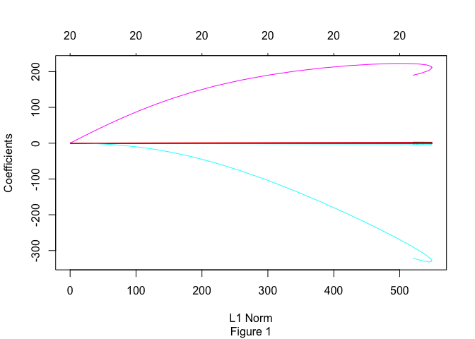
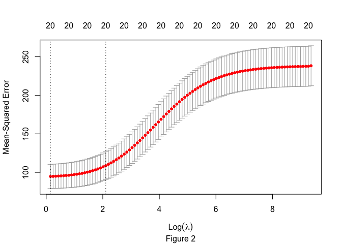
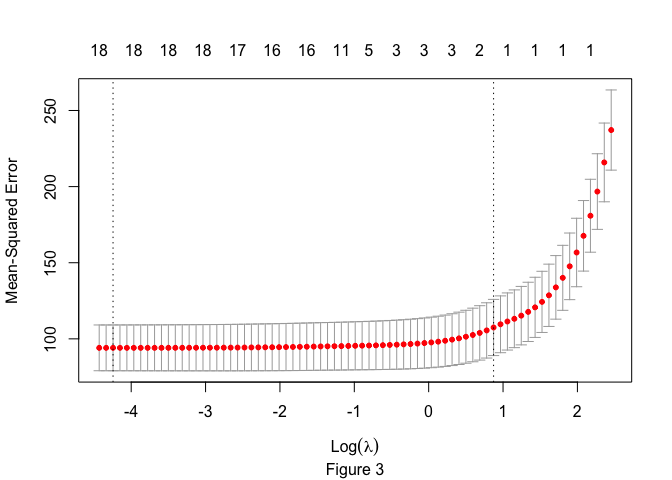

Problem 1: Green Buildings
--------------------------

Given a large dataset on characteristics of commercial rental properties
within the United States, our goal is to build the best predictive model
possible for the price. Some of the characteristics included in the
dataset include the building’s age, number of stories, electricity
costs, and average rent within the geographic region.

In addition, we also want to use this model to quantify the average
change in rental income per square foot associated with buildings that
have green certification.

We collapse LEED and EnergyStar certifications into a new dummy variable
that encompasses all “green certified” buildings.

Forward selection is used to select the predictive variables that add
significant variability to the statistical model.

    ## Start:  AIC=42834.95
    ## Rent ~ 1
    ## 
    ##                     Df Sum of Sq     RSS   AIC
    ## + cluster_rent       1   1028567  754964 35741
    ## + Electricity_Costs  1    279851 1503679 41129
    ## + total_dd_07        1    112052 1671478 41957
    ## + class_a            1     78603 1704927 42112
    ## + cluster            1     51722 1731808 42234
    ## + cd_total_07        1     50626 1732905 42239
    ## + hd_total07         1     44133 1739397 42268
    ## + size               1     33702 1749829 42315
    ## + renovated          1     27391 1756139 42343
    ## + class_b            1     26492 1757039 42347
    ## + stories            1     23957 1759574 42358
    ## + age                1     19116 1764415 42380
    ## + Precipitation      1      8528 1775002 42427
    ## + amenities          1      6525 1777006 42435
    ## + net                1      4614 1778916 42444
    ## + green_certified    1      1794 1781737 42456
    ## + green_rating       1      1794 1781737 42456
    ## + empl_gr            1      1173 1782357 42459
    ## <none>                           1783530 42462
    ## + Gas_Costs          1         2 1783528 42464
    ## 
    ## Step:  AIC=36052.6
    ## Rent ~ cluster_rent
    ## 
    ##                     Df Sum of Sq    RSS   AIC
    ## + size               1     43054 711910 35284
    ## + stories            1     28615 726349 35441
    ## + class_a            1     28478 726486 35443
    ## + amenities          1     15207 739757 35584
    ## + age                1     11301 743663 35625
    ## + class_b            1      7580 747384 35664
    ## + green_certified    1      3742 751222 35704
    ## + green_rating       1      3742 751222 35704
    ## + renovated          1      1408 753556 35729
    ## + hd_total07         1      1312 753652 35730
    ## + total_dd_07        1       745 754219 35736
    ## + Gas_Costs          1       688 754276 35736
    ## + cd_total_07        1       298 754666 35740
    ## <none>                           754964 35741
    ## + cluster            1        98 754866 35742
    ## + Electricity_Costs  1        92 754872 35742
    ## + net                1        67 754897 35743
    ## + Precipitation      1        10 754954 35743
    ## + empl_gr            1         0 754964 35743
    ## 
    ## Step:  AIC=35588.83
    ## Rent ~ cluster_rent + size
    ## 
    ##                     Df Sum of Sq    RSS   AIC
    ## + size:cluster_rent  1     38964 672946 34846
    ## + class_a            1      7086 704824 35208
    ## + age                1      4299 707610 35239
    ## + amenities          1      2073 709837 35263
    ## + green_certified    1      1751 710158 35267
    ## + green_rating       1      1751 710158 35267
    ## + renovated          1      1372 710537 35271
    ## + cluster            1      1308 710602 35272
    ## + net                1      1086 710824 35274
    ## + Precipitation      1      1039 710871 35275
    ## + Electricity_Costs  1      1022 710888 35275
    ## + class_b            1       975 710935 35275
    ## + cd_total_07        1       879 711030 35276
    ## + Gas_Costs          1       835 711075 35277
    ## <none>                           711910 35284
    ## + total_dd_07        1       165 711744 35284
    ## + empl_gr            1        58 711851 35285
    ## + hd_total07         1        21 711888 35286
    ## + stories            1        19 711891 35286
    ## 
    ## Step:  AIC=35148.79
    ## Rent ~ cluster_rent + size + cluster_rent:size
    ## 
    ##                     Df Sum of Sq    RSS   AIC
    ## + class_a            1    7797.4 665149 34757
    ## + age                1    6239.8 666706 34775
    ## + amenities          1    2698.2 670248 34817
    ## + green_certified    1    2180.6 670766 34823
    ## + green_rating       1    2180.6 670766 34823
    ## + Precipitation      1    2030.7 670915 34824
    ## + cluster            1    1505.4 671441 34830
    ## + cd_total_07        1    1346.3 671600 34832
    ## + renovated          1    1138.2 671808 34835
    ## + Gas_Costs          1    1135.0 671811 34835
    ## + total_dd_07        1    1063.3 671883 34836
    ## + class_b            1     921.6 672024 34837
    ## + Electricity_Costs  1     712.1 672234 34840
    ## + net                1     429.1 672517 34843
    ## <none>                           672946 34846
    ## + hd_total07         1     104.7 672841 34847
    ## + empl_gr            1      52.2 672894 34847
    ## + stories            1      35.8 672910 34848
    ## 
    ## Step:  AIC=35054.29
    ## Rent ~ cluster_rent + size + class_a + cluster_rent:size
    ## 
    ##                        Df Sum of Sq    RSS   AIC
    ## + class_b               1   2475.57 662673 34730
    ## + cd_total_07           1   1991.21 663157 34735
    ## + Precipitation         1   1828.42 663320 34737
    ## + Gas_Costs             1   1783.21 663365 34738
    ## + age                   1   1778.35 663370 34738
    ## + cluster               1   1458.31 663690 34742
    ## + amenities             1    778.76 664370 34750
    ## + net                   1    758.87 664390 34750
    ## + green_certified       1    703.56 664445 34751
    ## + green_rating          1    703.56 664445 34751
    ## + size:class_a          1    679.84 664469 34751
    ## + total_dd_07           1    508.28 664640 34753
    ## + Electricity_Costs     1    431.90 664717 34754
    ## + renovated             1    327.21 664821 34755
    ## <none>                              665149 34757
    ## + stories               1     83.33 665065 34758
    ## + hd_total07            1     16.63 665132 34759
    ## + class_a:cluster_rent  1     12.21 665136 34759
    ## + empl_gr               1      5.84 665143 34759
    ## 
    ## Step:  AIC=35027.24
    ## Rent ~ cluster_rent + size + class_a + class_b + cluster_rent:size
    ## 
    ##                        Df Sum of Sq    RSS   AIC
    ## + cd_total_07           1   1919.53 660754 34709
    ## + Gas_Costs             1   1664.25 661009 34712
    ## + Precipitation         1   1511.74 661161 34714
    ## + cluster               1   1368.83 661304 34715
    ## + age                   1   1028.12 661645 34720
    ## + net                   1    769.75 661903 34723
    ## + green_certified       1    603.93 662069 34725
    ## + green_rating          1    603.93 662069 34725
    ## + total_dd_07           1    509.26 662164 34726
    ## + amenities             1    491.19 662182 34726
    ## + Electricity_Costs     1    470.22 662203 34726
    ## + size:class_a          1    336.10 662337 34728
    ## + renovated             1    319.41 662354 34728
    ## + class_b:cluster_rent  1    232.18 662441 34729
    ## + size:class_b          1    177.87 662495 34730
    ## <none>                              662673 34730
    ## + stories               1    105.73 662567 34730
    ## + hd_total07            1     12.84 662660 34731
    ## + class_a:cluster_rent  1     12.13 662661 34732
    ## + empl_gr               1      2.07 662671 34732
    ## 
    ## Step:  AIC=35006.18
    ## Rent ~ cluster_rent + size + class_a + class_b + cd_total_07 + 
    ##     cluster_rent:size
    ## 
    ##                            Df Sum of Sq    RSS   AIC
    ## + age                       1   1828.81 658925 34689
    ## + cluster                   1   1132.34 659621 34698
    ## + Precipitation             1    937.77 659816 34700
    ## + size:cd_total_07          1    709.74 660044 34703
    ## + green_certified           1    667.77 660086 34703
    ## + green_rating              1    667.77 660086 34703
    ## + Electricity_Costs         1    603.76 660150 34704
    ## + net                       1    566.31 660187 34704
    ## + amenities                 1    544.92 660209 34705
    ## + empl_gr                   1    517.29 660236 34705
    ## + renovated                 1    512.34 660241 34705
    ## + Gas_Costs                 1    512.20 660241 34705
    ## + size:class_a              1    458.06 660296 34706
    ## + size:class_b              1    251.57 660502 34708
    ## + class_b:cluster_rent      1    174.77 660579 34709
    ## <none>                                  660754 34709
    ## + hd_total07                1    153.77 660600 34709
    ## + total_dd_07               1    153.77 660600 34709
    ## + stories                   1    147.54 660606 34709
    ## + cd_total_07:cluster_rent  1    116.78 660637 34710
    ## + class_b:cd_total_07       1     38.84 660715 34711
    ## + class_a:cd_total_07       1     17.19 660736 34711
    ## + class_a:cluster_rent      1      6.86 660747 34711
    ## 
    ## Step:  AIC=34987.69
    ## Rent ~ cluster_rent + size + class_a + class_b + cd_total_07 + 
    ##     age + cluster_rent:size
    ## 
    ##                            Df Sum of Sq    RSS   AIC
    ## + cluster                   1    885.87 658039 34681
    ## + Precipitation             1    598.80 658326 34684
    ## + net                       1    586.33 658338 34684
    ## + size:class_a              1    574.89 658350 34684
    ## + size:cd_total_07          1    565.62 658359 34685
    ## + empl_gr                   1    560.64 658364 34685
    ## + age:class_b               1    521.57 658403 34685
    ## + Electricity_Costs         1    496.32 658428 34685
    ## + amenities                 1    495.71 658429 34685
    ## + green_certified           1    463.66 658461 34686
    ## + green_rating              1    463.66 658461 34686
    ## + Gas_Costs                 1    356.20 658569 34687
    ## + age:cluster_rent          1    355.25 658570 34687
    ## + size:class_b              1    322.79 658602 34687
    ## + age:class_a               1    217.98 658707 34689
    ## + class_b:cluster_rent      1    188.09 658737 34689
    ## <none>                                  658925 34689
    ## + cd_total_07:cluster_rent  1    160.16 658765 34689
    ## + age:cd_total_07           1     35.02 658890 34691
    ## + stories                   1     33.00 658892 34691
    ## + hd_total07                1     24.78 658900 34691
    ## + total_dd_07               1     24.78 658900 34691
    ## + size:age                  1     19.90 658905 34691
    ## + class_a:cluster_rent      1     16.33 658908 34691
    ## + renovated                 1     14.75 658910 34691
    ## + class_a:cd_total_07       1      2.73 658922 34691
    ## + class_b:cd_total_07       1      0.14 658925 34691
    ## 
    ## Step:  AIC=34978.96
    ## Rent ~ cluster_rent + size + class_a + class_b + cd_total_07 + 
    ##     age + cluster + cluster_rent:size
    ## 
    ##                            Df Sum of Sq    RSS   AIC
    ## + cluster:size              1   2844.94 655194 34649
    ## + cluster:cluster_rent      1   2212.35 655827 34656
    ## + cluster:class_a           1    916.26 657123 34672
    ## + size:class_a              1    623.22 657416 34675
    ## + net                       1    619.00 657420 34675
    ## + cluster:class_b           1    562.65 657476 34676
    ## + empl_gr                   1    552.29 657487 34676
    ## + size:cd_total_07          1    544.44 657494 34676
    ## + amenities                 1    526.01 657513 34677
    ## + age:class_b               1    502.14 657537 34677
    ## + age:cluster_rent          1    451.70 657587 34677
    ## + cluster:age               1    424.39 657615 34678
    ## + green_certified           1    422.18 657617 34678
    ## + green_rating              1    422.18 657617 34678
    ## + Precipitation             1    407.57 657631 34678
    ## + Electricity_Costs         1    349.49 657689 34679
    ## + size:class_b              1    345.07 657694 34679
    ## + age:class_a               1    241.25 657798 34680
    ## + Gas_Costs                 1    228.68 657810 34680
    ## + class_b:cluster_rent      1    206.30 657833 34680
    ## <none>                                  658039 34681
    ## + cd_total_07:cluster_rent  1     83.09 657956 34682
    ## + class_a:cluster_rent      1     32.84 658006 34682
    ## + size:age                  1     23.40 658016 34682
    ## + stories                   1     19.37 658020 34683
    ## + age:cd_total_07           1     14.43 658024 34683
    ## + renovated                 1     10.19 658029 34683
    ## + cluster:cd_total_07       1      2.09 658037 34683
    ## + class_b:cd_total_07       1      1.04 658038 34683
    ## + class_a:cd_total_07       1      0.30 658039 34683
    ## + hd_total07                1      0.11 658039 34683
    ## + total_dd_07               1      0.11 658039 34683
    ## 
    ## Step:  AIC=34947.08
    ## Rent ~ cluster_rent + size + class_a + class_b + cd_total_07 + 
    ##     age + cluster + cluster_rent:size + size:cluster
    ## 
    ##                            Df Sum of Sq    RSS   AIC
    ## + cluster:cluster_rent      1   2425.00 652769 34622
    ## + net                       1    622.45 654572 34643
    ## + empl_gr                   1    582.44 654612 34644
    ## + age:class_b               1    551.46 654642 34644
    ## + Precipitation             1    506.47 654687 34645
    ## + amenities                 1    468.75 654725 34645
    ## + Electricity_Costs         1    455.45 654739 34645
    ## + size:class_a              1    397.01 654797 34646
    ## + green_certified           1    385.65 654808 34646
    ## + green_rating              1    385.65 654808 34646
    ## + age:cluster_rent          1    371.66 654822 34646
    ## + size:cd_total_07          1    358.72 654835 34647
    ## + Gas_Costs                 1    297.68 654896 34647
    ## + class_b:cluster_rent      1    231.08 654963 34648
    ## + age:class_a               1    197.97 654996 34649
    ## + size:class_b              1    197.45 654997 34649
    ## <none>                                  655194 34649
    ## + cluster:class_b           1     95.05 655099 34650
    ## + cd_total_07:cluster_rent  1     88.05 655106 34650
    ## + cluster:age               1     79.63 655114 34650
    ## + stories                   1     61.97 655132 34650
    ## + size:age                  1     45.92 655148 34650
    ## + cluster:class_a           1     40.56 655153 34650
    ## + age:cd_total_07           1     28.39 655166 34651
    ## + class_a:cluster_rent      1     27.91 655166 34651
    ## + cluster:cd_total_07       1     17.76 655176 34651
    ## + class_a:cd_total_07       1     11.70 655182 34651
    ## + renovated                 1      8.69 655185 34651
    ## + hd_total07                1      5.77 655188 34651
    ## + total_dd_07               1      5.77 655188 34651
    ## + class_b:cd_total_07       1      0.17 655194 34651
    ## 
    ## Step:  AIC=34921.45
    ## Rent ~ cluster_rent + size + class_a + class_b + cd_total_07 + 
    ##     age + cluster + cluster_rent:size + size:cluster + cluster_rent:cluster
    ## 
    ##                            Df Sum of Sq    RSS   AIC
    ## + net                       1    653.45 652116 34616
    ## + age:class_b               1    579.17 652190 34617
    ## + empl_gr                   1    540.71 652228 34617
    ## + amenities                 1    504.49 652264 34618
    ## + Precipitation             1    423.99 652345 34619
    ## + Electricity_Costs         1    396.59 652372 34619
    ## + size:class_a              1    390.10 652379 34619
    ## + green_certified           1    383.11 652386 34619
    ## + green_rating              1    383.11 652386 34619
    ## + size:cd_total_07          1    368.24 652401 34619
    ## + age:cluster_rent          1    350.50 652418 34620
    ## + Gas_Costs                 1    328.16 652441 34620
    ## + size:class_b              1    189.94 652579 34622
    ## + age:class_a               1    180.74 652588 34622
    ## + class_b:cluster_rent      1    170.60 652598 34622
    ## <none>                                  652769 34622
    ## + stories                   1     99.46 652669 34623
    ## + age:cd_total_07           1     68.10 652701 34623
    ## + cluster:cd_total_07       1     63.65 652705 34623
    ## + cluster:age               1     62.69 652706 34623
    ## + size:age                  1     47.72 652721 34623
    ## + cluster:class_b           1     40.57 652728 34623
    ## + hd_total07                1     24.72 652744 34624
    ## + total_dd_07               1     24.72 652744 34624
    ## + class_a:cd_total_07       1     24.36 652745 34624
    ## + class_a:cluster_rent      1     12.06 652757 34624
    ## + cd_total_07:cluster_rent  1      5.25 652764 34624
    ## + renovated                 1      2.34 652767 34624
    ## + class_b:cd_total_07       1      1.52 652767 34624
    ## + cluster:class_a           1      1.01 652768 34624
    ## 
    ## Step:  AIC=34915.43
    ## Rent ~ cluster_rent + size + class_a + class_b + cd_total_07 + 
    ##     age + cluster + net + cluster_rent:size + size:cluster + 
    ##     cluster_rent:cluster
    ## 
    ##                            Df Sum of Sq    RSS   AIC
    ## + net:cluster_rent          1    600.67 651515 34611
    ## + net:cd_total_07           1    594.72 651521 34611
    ## + age:class_b               1    573.60 651542 34611
    ## + Electricity_Costs         1    495.27 651620 34612
    ## + empl_gr                   1    479.96 651636 34612
    ## + amenities                 1    473.05 651642 34612
    ## + Precipitation             1    403.38 651712 34613
    ## + green_certified           1    384.88 651731 34613
    ## + green_rating              1    384.88 651731 34613
    ## + size:class_a              1    324.16 651791 34614
    ## + age:cluster_rent          1    319.06 651796 34614
    ## + size:cd_total_07          1    313.30 651802 34614
    ## + Gas_Costs                 1    258.36 651857 34615
    ## + cluster:net               1    226.96 651889 34615
    ## + age:class_a               1    191.53 651924 34616
    ## <none>                                  652116 34616
    ## + class_b:cluster_rent      1    164.68 651951 34616
    ## + size:class_b              1    148.02 651967 34616
    ## + stories                   1     93.86 652022 34617
    ## + age:cd_total_07           1     85.44 652030 34617
    ## + cluster:cd_total_07       1     66.09 652049 34617
    ## + cluster:age               1     62.23 652053 34617
    ## + size:age                  1     60.38 652055 34617
    ## + class_a:cd_total_07       1     51.82 652064 34617
    ## + cluster:class_b           1     38.01 652078 34618
    ## + hd_total07                1     23.84 652092 34618
    ## + total_dd_07               1     23.84 652092 34618
    ## + cd_total_07:cluster_rent  1     12.14 652103 34618
    ## + class_b:net               1      8.32 652107 34618
    ## + class_a:cluster_rent      1      7.35 652108 34618
    ## + class_b:cd_total_07       1      6.32 652109 34618
    ## + class_a:net               1      5.88 652110 34618
    ## + renovated                 1      2.77 652113 34618
    ## + age:net                   1      2.25 652113 34618
    ## + cluster:class_a           1      0.43 652115 34618
    ## + size:net                  1      0.26 652115 34618
    ## 
    ## Step:  AIC=34910.21
    ## Rent ~ cluster_rent + size + class_a + class_b + cd_total_07 + 
    ##     age + cluster + net + cluster_rent:size + size:cluster + 
    ##     cluster_rent:cluster + cluster_rent:net
    ## 
    ##                            Df Sum of Sq    RSS   AIC
    ## + age:class_b               1    622.37 650892 34605
    ## + empl_gr                   1    477.00 651038 34607
    ## + amenities                 1    472.01 651043 34607
    ## + Electricity_Costs         1    455.44 651059 34607
    ## + green_certified           1    379.07 651136 34608
    ## + green_rating              1    379.07 651136 34608
    ## + Precipitation             1    374.03 651141 34608
    ## + size:class_a              1    359.47 651155 34609
    ## + net:cd_total_07           1    357.41 651157 34609
    ## + size:cd_total_07          1    325.64 651189 34609
    ## + age:cluster_rent          1    319.21 651196 34609
    ## + Gas_Costs                 1    298.52 651216 34609
    ## + class_b:cluster_rent      1    202.11 651313 34610
    ## + size:class_b              1    170.72 651344 34611
    ## <none>                                  651515 34611
    ## + age:class_a               1    156.16 651359 34611
    ## + cluster:net               1     94.99 651420 34612
    ## + stories                   1     84.65 651430 34612
    ## + cluster:cd_total_07       1     73.62 651441 34612
    ## + age:cd_total_07           1     67.27 651448 34612
    ## + cluster:age               1     65.17 651450 34612
    ## + size:age                  1     49.63 651465 34612
    ## + class_a:cd_total_07       1     40.13 651475 34612
    ## + cluster:class_b           1     39.33 651476 34612
    ## + class_a:cluster_rent      1     21.62 651493 34613
    ## + size:net                  1     20.73 651494 34613
    ## + hd_total07                1     16.68 651498 34613
    ## + total_dd_07               1     16.68 651498 34613
    ## + age:net                   1     14.16 651501 34613
    ## + cd_total_07:cluster_rent  1      5.18 651510 34613
    ## + renovated                 1      4.90 651510 34613
    ## + class_a:net               1      3.59 651511 34613
    ## + class_b:cd_total_07       1      3.49 651511 34613
    ## + class_b:net               1      2.50 651512 34613
    ## + cluster:class_a           1      1.03 651514 34613
    ## 
    ## Step:  AIC=34903.44
    ## Rent ~ cluster_rent + size + class_a + class_b + cd_total_07 + 
    ##     age + cluster + net + cluster_rent:size + size:cluster + 
    ##     cluster_rent:cluster + cluster_rent:net + class_b:age
    ## 
    ##                            Df Sum of Sq    RSS   AIC
    ## + age:class_a               1   1298.39 649594 34592
    ## + empl_gr                   1    504.51 650388 34601
    ## + Electricity_Costs         1    457.29 650435 34602
    ## + green_certified           1    422.40 650470 34602
    ## + green_rating              1    422.40 650470 34602
    ## + amenities                 1    384.48 650508 34603
    ## + size:class_a              1    384.11 650508 34603
    ## + Precipitation             1    379.64 650513 34603
    ## + net:cd_total_07           1    365.39 650527 34603
    ## + age:cluster_rent          1    347.06 650545 34603
    ## + size:cd_total_07          1    318.85 650574 34604
    ## + Gas_Costs                 1    282.92 650610 34604
    ## + size:class_b              1    197.90 650695 34605
    ## + class_b:cluster_rent      1    191.12 650701 34605
    ## <none>                                  650892 34605
    ## + age:cd_total_07           1    158.18 650734 34605
    ## + size:age                  1    105.01 650787 34606
    ## + cluster:net               1     94.65 650798 34606
    ## + stories                   1     91.93 650801 34606
    ## + class_a:cd_total_07       1     87.57 650805 34606
    ## + cluster:cd_total_07       1     75.17 650817 34606
    ## + cluster:class_b           1     60.79 650832 34607
    ## + class_b:cd_total_07       1     49.88 650843 34607
    ## + cluster:age               1     48.99 650843 34607
    ## + size:net                  1     25.20 650867 34607
    ## + hd_total07                1     24.74 650868 34607
    ## + total_dd_07               1     24.74 650868 34607
    ## + renovated                 1     21.25 650871 34607
    ## + class_a:cluster_rent      1     13.27 650879 34607
    ## + cd_total_07:cluster_rent  1     12.49 650880 34607
    ## + class_a:net               1      6.80 650886 34607
    ## + age:net                   1      6.74 650886 34607
    ## + cluster:class_a           1      1.13 650891 34607
    ## + class_b:net               1      0.58 650892 34607
    ## 
    ## Step:  AIC=34892.47
    ## Rent ~ cluster_rent + size + class_a + class_b + cd_total_07 + 
    ##     age + cluster + net + cluster_rent:size + size:cluster + 
    ##     cluster_rent:cluster + cluster_rent:net + class_b:age + class_a:age
    ## 
    ##                            Df Sum of Sq    RSS   AIC
    ## + Electricity_Costs         1    571.46 649023 34587
    ## + empl_gr                   1    462.31 649132 34588
    ## + Precipitation             1    380.13 649214 34589
    ## + net:cd_total_07           1    361.76 649232 34589
    ## + size:class_a              1    358.80 649235 34589
    ## + size:cd_total_07          1    356.25 649238 34589
    ## + amenities                 1    346.80 649247 34590
    ## + green_certified           1    304.09 649290 34590
    ## + green_rating              1    304.09 649290 34590
    ## + Gas_Costs                 1    291.88 649302 34590
    ## + class_b:cluster_rent      1    242.56 649352 34591
    ## + size:class_b              1    195.70 649398 34591
    ## + age:cluster_rent          1    171.14 649423 34592
    ## <none>                                  649594 34592
    ## + age:cd_total_07           1    105.90 649488 34592
    ## + cluster:net               1    102.62 649491 34593
    ## + cluster:cd_total_07       1     84.89 649509 34593
    ## + cluster:class_b           1     83.61 649510 34593
    ## + stories                   1     78.14 649516 34593
    ## + hd_total07                1     51.88 649542 34593
    ## + total_dd_07               1     51.88 649542 34593
    ## + cluster:age               1     51.58 649542 34593
    ## + class_b:cd_total_07       1     44.32 649550 34593
    ## + age:net                   1     30.81 649563 34593
    ## + class_a:cd_total_07       1     30.38 649564 34593
    ## + class_a:cluster_rent      1     22.98 649571 34593
    ## + cd_total_07:cluster_rent  1     14.63 649579 34594
    ## + size:net                  1     14.44 649580 34594
    ## + class_a:net               1      4.52 649590 34594
    ## + class_b:net               1      1.69 649592 34594
    ## + size:age                  1      0.76 649593 34594
    ## + cluster:class_a           1      0.34 649594 34594
    ## + renovated                 1      0.13 649594 34594
    ## 
    ## Step:  AIC=34887
    ## Rent ~ cluster_rent + size + class_a + class_b + cd_total_07 + 
    ##     age + cluster + net + Electricity_Costs + cluster_rent:size + 
    ##     size:cluster + cluster_rent:cluster + cluster_rent:net + 
    ##     class_b:age + class_a:age
    ## 
    ##                                  Df Sum of Sq    RSS   AIC
    ## + cd_total_07:Electricity_Costs   1    678.94 648344 34581
    ## + empl_gr                         1    669.61 648353 34581
    ## + Gas_Costs                       1    592.87 648430 34582
    ## + Electricity_Costs:cluster_rent  1    502.73 648520 34583
    ## + amenities                       1    480.59 648542 34583
    ## + size:Electricity_Costs          1    474.14 648548 34583
    ## + cluster:Electricity_Costs       1    455.79 648567 34583
    ## + size:class_a                    1    393.83 648629 34584
    ## + size:cd_total_07                1    387.71 648635 34584
    ## + class_b:Electricity_Costs       1    322.61 648700 34585
    ## + class_b:cluster_rent            1    293.01 648730 34585
    ## + green_certified                 1    279.44 648743 34586
    ## + green_rating                    1    279.44 648743 34586
    ## + age:cluster_rent                1    270.97 648752 34586
    ## + net:cd_total_07                 1    229.75 648793 34586
    ## + size:class_b                    1    212.65 648810 34586
    ## + cluster:cd_total_07             1    193.45 648829 34587
    ## + Precipitation                   1    173.88 648849 34587
    ## <none>                                        649023 34587
    ## + net:Electricity_Costs           1    126.17 648896 34587
    ## + hd_total07                      1    125.86 648897 34587
    ## + total_dd_07                     1    125.86 648897 34587
    ## + cluster:class_b                 1    105.27 648917 34588
    ## + age:cd_total_07                 1     94.77 648928 34588
    ## + cluster:net                     1     78.31 648944 34588
    ## + stories                         1     72.08 648951 34588
    ## + cluster:age                     1     63.64 648959 34588
    ## + class_a:cluster_rent            1     44.98 648978 34588
    ## + class_a:Electricity_Costs       1     41.86 648981 34588
    ## + age:net                         1     34.17 648988 34588
    ## + cd_total_07:cluster_rent        1     31.46 648991 34589
    ## + class_b:cd_total_07             1     30.24 648992 34589
    ## + age:Electricity_Costs           1     21.86 649001 34589
    ## + class_a:cd_total_07             1     18.89 649004 34589
    ## + size:net                        1      7.44 649015 34589
    ## + class_a:net                     1      5.95 649017 34589
    ## + cluster:class_a                 1      3.70 649019 34589
    ## + class_b:net                     1      0.95 649022 34589
    ## + size:age                        1      0.07 649023 34589
    ## + renovated                       1      0.04 649023 34589
    ## 
    ## Step:  AIC=34880.61
    ## Rent ~ cluster_rent + size + class_a + class_b + cd_total_07 + 
    ##     age + cluster + net + Electricity_Costs + cluster_rent:size + 
    ##     size:cluster + cluster_rent:cluster + cluster_rent:net + 
    ##     class_b:age + class_a:age + cd_total_07:Electricity_Costs
    ## 
    ##                                  Df Sum of Sq    RSS   AIC
    ## + hd_total07                      1    711.32 647632 34574
    ## + total_dd_07                     1    711.32 647632 34574
    ## + class_b:Electricity_Costs       1    519.84 647824 34576
    ## + size:cd_total_07                1    473.53 647870 34577
    ## + size:class_a                    1    424.34 647919 34578
    ## + net:cd_total_07                 1    420.04 647924 34578
    ## + size:Electricity_Costs          1    410.77 647933 34578
    ## + amenities                       1    407.54 647936 34578
    ## + net:Electricity_Costs           1    407.40 647936 34578
    ## + empl_gr                         1    327.59 648016 34579
    ## + Electricity_Costs:cluster_rent  1    308.32 648035 34579
    ## + class_b:cluster_rent            1    292.74 648051 34579
    ## + age:cluster_rent                1    285.52 648058 34579
    ## + size:class_b                    1    238.50 648105 34580
    ## + green_certified                 1    226.72 648117 34580
    ## + green_rating                    1    226.72 648117 34580
    ## + cluster:Electricity_Costs       1    194.95 648149 34580
    ## <none>                                        648344 34581
    ## + cluster:cd_total_07             1    129.13 648215 34581
    ## + cluster:net                     1    123.96 648220 34581
    ## + class_a:Electricity_Costs       1    109.60 648234 34581
    ## + cluster:class_b                 1     99.92 648244 34581
    ## + age:cd_total_07                 1     86.99 648257 34582
    ## + class_b:cd_total_07             1     56.82 648287 34582
    ## + cluster:age                     1     55.03 648289 34582
    ## + Gas_Costs                       1     50.26 648293 34582
    ## + class_a:cluster_rent            1     44.98 648299 34582
    ## + class_a:cd_total_07             1     28.48 648315 34582
    ## + age:net                         1     26.82 648317 34582
    ## + stories                         1     25.84 648318 34582
    ## + size:net                        1     20.91 648323 34582
    ## + cd_total_07:cluster_rent        1     12.97 648331 34583
    ## + class_a:net                     1      7.02 648337 34583
    ## + Precipitation                   1      3.19 648340 34583
    ## + cluster:class_a                 1      1.58 648342 34583
    ## + class_b:net                     1      1.20 648342 34583
    ## + age:Electricity_Costs           1      0.78 648343 34583
    ## + size:age                        1      0.02 648344 34583
    ## + renovated                       1      0.00 648344 34583
    ## 
    ## Step:  AIC=34874.97
    ## Rent ~ cluster_rent + size + class_a + class_b + cd_total_07 + 
    ##     age + cluster + net + Electricity_Costs + hd_total07 + cluster_rent:size + 
    ##     size:cluster + cluster_rent:cluster + cluster_rent:net + 
    ##     class_b:age + class_a:age + cd_total_07:Electricity_Costs
    ## 
    ##                                  Df Sum of Sq    RSS   AIC
    ## + cd_total_07:hd_total07          1    771.74 646861 34567
    ## + class_a:hd_total07              1    570.26 647062 34569
    ## + class_b:Electricity_Costs       1    504.83 647128 34570
    ## + age:cluster_rent                1    477.19 647155 34570
    ## + net:cd_total_07                 1    464.31 647168 34571
    ## + size:Electricity_Costs          1    461.44 647171 34571
    ## + net:Electricity_Costs           1    455.79 647177 34571
    ## + amenities                       1    421.93 647210 34571
    ## + size:cd_total_07                1    403.20 647229 34571
    ## + size:class_a                    1    363.00 647269 34572
    ## + empl_gr                         1    324.87 647307 34572
    ## + class_b:hd_total07              1    281.28 647351 34573
    ## + green_certified                 1    258.30 647374 34573
    ## + green_rating                    1    258.30 647374 34573
    ## + class_b:cluster_rent            1    255.01 647377 34573
    ## + size:class_b                    1    189.44 647443 34574
    ## <none>                                        647632 34574
    ## + cluster:Electricity_Costs       1    158.10 647474 34574
    ## + cluster:net                     1    110.36 647522 34575
    ## + cluster:class_b                 1    106.05 647526 34575
    ## + hd_total07:cluster_rent         1    105.86 647526 34575
    ## + class_a:Electricity_Costs       1    100.90 647531 34575
    ## + age:cd_total_07                 1     99.30 647533 34575
    ## + cluster:cd_total_07             1     86.44 647546 34575
    ## + cluster:age                     1     78.13 647554 34575
    ## + class_b:cd_total_07             1     65.96 647566 34575
    ## + size:hd_total07                 1     61.49 647571 34575
    ## + stories                         1     56.81 647576 34575
    ## + cd_total_07:cluster_rent        1     54.68 647578 34575
    ## + age:hd_total07                  1     49.25 647583 34576
    ## + Gas_Costs                       1     47.02 647585 34576
    ## + hd_total07:Electricity_Costs    1     40.54 647592 34576
    ## + class_a:cluster_rent            1     38.09 647594 34576
    ## + size:net                        1     31.13 647601 34576
    ## + class_a:cd_total_07             1     24.59 647608 34576
    ## + net:hd_total07                  1     22.14 647610 34576
    ## + cluster:hd_total07              1     20.88 647611 34576
    ## + age:net                         1     20.55 647612 34576
    ## + age:Electricity_Costs           1     17.96 647614 34576
    ## + Precipitation                   1     17.73 647615 34576
    ## + Electricity_Costs:cluster_rent  1     15.58 647617 34576
    ## + renovated                       1     12.15 647620 34576
    ## + cluster:class_a                 1      5.45 647627 34576
    ## + class_b:net                     1      3.70 647629 34576
    ## + class_a:net                     1      3.41 647629 34576
    ## + size:age                        1      2.12 647630 34576
    ## 
    ## Step:  AIC=34868.44
    ## Rent ~ cluster_rent + size + class_a + class_b + cd_total_07 + 
    ##     age + cluster + net + Electricity_Costs + hd_total07 + cluster_rent:size + 
    ##     size:cluster + cluster_rent:cluster + cluster_rent:net + 
    ##     class_b:age + class_a:age + cd_total_07:Electricity_Costs + 
    ##     cd_total_07:hd_total07
    ## 
    ##                                  Df Sum of Sq    RSS   AIC
    ## + age:cluster_rent                1    686.72 646174 34560
    ## + class_a:hd_total07              1    568.35 646292 34562
    ## + amenities                       1    544.52 646316 34562
    ## + class_b:Electricity_Costs       1    490.17 646370 34563
    ## + net:Electricity_Costs           1    455.10 646406 34563
    ## + size:Electricity_Costs          1    451.75 646409 34563
    ## + size:class_a                    1    419.18 646441 34564
    ## + net:cd_total_07                 1    411.41 646449 34564
    ## + size:cd_total_07                1    339.47 646521 34565
    ## + class_b:hd_total07              1    284.52 646576 34565
    ## + class_b:cluster_rent            1    277.96 646583 34565
    ## + green_certified                 1    268.84 646592 34566
    ## + green_rating                    1    268.84 646592 34566
    ## + size:class_b                    1    216.50 646644 34566
    ## + cluster:Electricity_Costs       1    179.76 646681 34567
    ## <none>                                        646861 34567
    ## + class_a:Electricity_Costs       1    118.24 646742 34567
    ## + cluster:class_b                 1    108.01 646753 34567
    ## + cluster:net                     1    106.13 646754 34568
    ## + hd_total07:Electricity_Costs    1     98.03 646763 34568
    ## + cluster:age                     1     97.50 646763 34568
    ## + stories                         1     91.23 646769 34568
    ## + cluster:cd_total_07             1     82.27 646778 34568
    ## + size:hd_total07                 1     68.38 646792 34568
    ## + hd_total07:cluster_rent         1     58.02 646803 34568
    ## + class_a:cluster_rent            1     57.73 646803 34568
    ## + class_b:cd_total_07             1     49.38 646811 34568
    ## + age:Electricity_Costs           1     45.63 646815 34568
    ## + cd_total_07:cluster_rent        1     36.25 646824 34568
    ## + empl_gr                         1     36.19 646824 34568
    ## + age:hd_total07                  1     32.92 646828 34568
    ## + age:net                         1     24.65 646836 34568
    ## + Gas_Costs                       1     21.39 646839 34569
    ## + Electricity_Costs:cluster_rent  1     21.39 646839 34569
    ## + size:net                        1     21.20 646839 34569
    ## + cluster:hd_total07              1     18.46 646842 34569
    ## + net:hd_total07                  1     17.75 646843 34569
    ## + Precipitation                   1     15.51 646845 34569
    ## + renovated                       1     11.54 646849 34569
    ## + cluster:class_a                 1      7.36 646853 34569
    ## + class_b:net                     1      5.40 646855 34569
    ## + class_a:cd_total_07             1      4.73 646856 34569
    ## + class_a:net                     1      2.60 646858 34569
    ## + size:age                        1      1.17 646859 34569
    ## + age:cd_total_07                 1      0.76 646860 34569
    ## 
    ## Step:  AIC=34863.1
    ## Rent ~ cluster_rent + size + class_a + class_b + cd_total_07 + 
    ##     age + cluster + net + Electricity_Costs + hd_total07 + cluster_rent:size + 
    ##     size:cluster + cluster_rent:cluster + cluster_rent:net + 
    ##     class_b:age + class_a:age + cd_total_07:Electricity_Costs + 
    ##     cd_total_07:hd_total07 + cluster_rent:age
    ## 
    ##                                  Df Sum of Sq    RSS   AIC
    ## + amenities                       1    461.60 645712 34557
    ## + net:Electricity_Costs           1    451.63 645722 34557
    ## + size:Electricity_Costs          1    443.73 645730 34557
    ## + net:cd_total_07                 1    440.90 645733 34557
    ## + class_a:hd_total07              1    403.64 645770 34558
    ## + size:class_a                    1    325.16 645849 34559
    ## + class_b:Electricity_Costs       1    314.88 645859 34559
    ## + green_certified                 1    299.53 645874 34559
    ## + green_rating                    1    299.53 645874 34559
    ## + hd_total07:Electricity_Costs    1    292.29 645882 34559
    ## + size:cd_total_07                1    269.70 645904 34559
    ## + class_b:hd_total07              1    206.49 645967 34560
    ## + cluster:Electricity_Costs       1    190.54 645983 34560
    ## <none>                                        646174 34560
    ## + size:class_b                    1    158.17 646016 34561
    ## + age:Electricity_Costs           1    126.66 646047 34561
    ## + cluster:net                     1    103.82 646070 34561
    ## + class_b:cluster_rent            1     96.27 646078 34561
    ## + cd_total_07:cluster_rent        1     93.66 646080 34561
    ## + cluster:cd_total_07             1     87.73 646086 34561
    ## + class_b:cd_total_07             1     85.32 646089 34561
    ## + cluster:class_b                 1     74.68 646099 34562
    ## + Electricity_Costs:cluster_rent  1     73.71 646100 34562
    ## + size:hd_total07                 1     70.38 646104 34562
    ## + age:cd_total_07                 1     57.07 646117 34562
    ## + stories                         1     46.62 646127 34562
    ## + Gas_Costs                       1     41.18 646133 34562
    ## + cluster:hd_total07              1     38.89 646135 34562
    ## + class_a:cd_total_07             1     32.09 646142 34562
    ## + Precipitation                   1     30.84 646143 34562
    ## + class_a:cluster_rent            1     26.93 646147 34562
    ## + net:hd_total07                  1     22.16 646152 34562
    ## + size:net                        1     20.24 646154 34562
    ## + class_a:Electricity_Costs       1     14.80 646159 34562
    ## + empl_gr                         1     12.69 646161 34562
    ## + renovated                       1     11.90 646162 34562
    ## + cluster:age                     1     11.39 646163 34562
    ## + age:net                         1     11.34 646163 34562
    ## + age:hd_total07                  1     10.35 646164 34562
    ## + class_a:net                     1     10.00 646164 34562
    ## + size:age                        1      8.37 646166 34562
    ## + hd_total07:cluster_rent         1      5.42 646168 34562
    ## + class_b:net                     1      0.55 646173 34562
    ## + cluster:class_a                 1      0.34 646174 34562
    ## 
    ## Step:  AIC=34860.09
    ## Rent ~ cluster_rent + size + class_a + class_b + cd_total_07 + 
    ##     age + cluster + net + Electricity_Costs + hd_total07 + amenities + 
    ##     cluster_rent:size + size:cluster + cluster_rent:cluster + 
    ##     cluster_rent:net + class_b:age + class_a:age + cd_total_07:Electricity_Costs + 
    ##     cd_total_07:hd_total07 + cluster_rent:age
    ## 
    ##                                  Df Sum of Sq    RSS   AIC
    ## + amenities:Electricity_Costs     1    433.52 645279 34554
    ## + net:Electricity_Costs           1    431.46 645281 34554
    ## + size:Electricity_Costs          1    424.85 645287 34554
    ## + net:cd_total_07                 1    418.28 645294 34554
    ## + class_b:amenities               1    405.21 645307 34554
    ## + class_a:hd_total07              1    351.26 645361 34555
    ## + class_b:Electricity_Costs       1    297.88 645414 34555
    ## + hd_total07:Electricity_Costs    1    294.74 645418 34555
    ## + size:cd_total_07                1    286.49 645426 34555
    ## + amenities:hd_total07            1    285.24 645427 34555
    ## + green_certified                 1    283.23 645429 34555
    ## + green_rating                    1    283.23 645429 34555
    ## + class_a:amenities               1    242.35 645470 34556
    ## + size:class_a                    1    225.15 645487 34556
    ## + class_b:hd_total07              1    187.33 645525 34557
    ## + cluster:Electricity_Costs       1    184.74 645528 34557
    ## <none>                                        645712 34557
    ## + age:Electricity_Costs           1    141.20 645571 34557
    ## + cd_total_07:cluster_rent        1    111.35 645601 34558
    ## + class_b:cd_total_07             1    105.16 645607 34558
    ## + cluster:net                     1    103.72 645609 34558
    ## + size:class_b                    1    101.62 645611 34558
    ## + cluster:cd_total_07             1    100.60 645612 34558
    ## + class_b:cluster_rent            1    100.45 645612 34558
    ## + Electricity_Costs:cluster_rent  1     94.43 645618 34558
    ## + amenities:cluster_rent          1     89.49 645623 34558
    ## + age:cd_total_07                 1     86.81 645625 34558
    ## + stories                         1     83.36 645629 34558
    ## + cluster:class_b                 1     69.19 645643 34558
    ## + class_a:cd_total_07             1     52.64 645660 34558
    ## + size:hd_total07                 1     49.94 645662 34558
    ## + cluster:amenities               1     41.52 645671 34558
    ## + cluster:hd_total07              1     38.19 645674 34558
    ## + Precipitation                   1     33.45 645679 34558
    ## + Gas_Costs                       1     31.61 645681 34559
    ## + class_a:cluster_rent            1     29.95 645682 34559
    ## + net:hd_total07                  1     20.71 645692 34559
    ## + empl_gr                         1     19.27 645693 34559
    ## + size:net                        1     19.23 645693 34559
    ## + size:age                        1     15.99 645696 34559
    ## + age:hd_total07                  1     12.90 645699 34559
    ## + class_a:net                     1     11.63 645701 34559
    ## + amenities:cd_total_07           1      8.81 645703 34559
    ## + age:net                         1      8.50 645704 34559
    ## + class_a:Electricity_Costs       1      7.94 645704 34559
    ## + age:amenities                   1      6.79 645706 34559
    ## + size:amenities                  1      6.05 645706 34559
    ## + cluster:age                     1      5.79 645707 34559
    ## + renovated                       1      4.77 645708 34559
    ## + cluster:class_a                 1      3.41 645709 34559
    ## + hd_total07:cluster_rent         1      2.49 645710 34559
    ## + net:amenities                   1      0.19 645712 34559
    ## + class_b:net                     1      0.12 645712 34559
    ## 
    ## Step:  AIC=34857.31
    ## Rent ~ cluster_rent + size + class_a + class_b + cd_total_07 + 
    ##     age + cluster + net + Electricity_Costs + hd_total07 + amenities + 
    ##     cluster_rent:size + size:cluster + cluster_rent:cluster + 
    ##     cluster_rent:net + class_b:age + class_a:age + cd_total_07:Electricity_Costs + 
    ##     cd_total_07:hd_total07 + cluster_rent:age + Electricity_Costs:amenities
    ## 
    ##                                  Df Sum of Sq    RSS   AIC
    ## + amenities:cluster_rent          1    531.28 644747 34549
    ## + class_b:amenities               1    455.47 644823 34550
    ## + net:cd_total_07                 1    334.81 644944 34552
    ## + class_a:amenities               1    332.72 644946 34552
    ## + net:Electricity_Costs           1    328.44 644950 34552
    ## + size:cd_total_07                1    271.99 645007 34552
    ## + green_certified                 1    270.46 645008 34552
    ## + green_rating                    1    270.46 645008 34552
    ## + hd_total07:Electricity_Costs    1    255.44 645023 34553
    ## + size:Electricity_Costs          1    237.69 645041 34553
    ## + age:Electricity_Costs           1    233.39 645045 34553
    ## + size:class_a                    1    232.92 645046 34553
    ## + class_b:Electricity_Costs       1    214.70 645064 34553
    ## + class_a:hd_total07              1    214.52 645064 34553
    ## + cluster:Electricity_Costs       1    194.56 645084 34553
    ## <none>                                        645279 34554
    ## + class_b:cd_total_07             1    142.09 645137 34554
    ## + cluster:amenities               1    132.78 645146 34554
    ## + cd_total_07:cluster_rent        1    129.15 645150 34554
    ## + class_b:hd_total07              1    124.41 645154 34554
    ## + age:cd_total_07                 1    110.09 645169 34554
    ## + size:class_b                    1    105.62 645173 34554
    ## + class_a:cd_total_07             1     97.42 645181 34554
    ## + cluster:cd_total_07             1     87.89 645191 34555
    ## + cluster:net                     1     83.62 645195 34555
    ## + class_b:cluster_rent            1     80.03 645199 34555
    ## + Electricity_Costs:cluster_rent  1     77.54 645201 34555
    ## + stories                         1     66.37 645212 34555
    ## + class_a:cluster_rent            1     64.08 645215 34555
    ## + cluster:class_b                 1     62.53 645216 34555
    ## + cluster:hd_total07              1     35.81 645243 34555
    ## + age:hd_total07                  1     35.56 645243 34555
    ## + Precipitation                   1     29.98 645249 34555
    ## + amenities:cd_total_07           1     29.03 645250 34555
    ## + age:amenities                   1     27.32 645251 34555
    ## + empl_gr                         1     24.91 645254 34555
    ## + size:net                        1     23.04 645256 34555
    ## + Gas_Costs                       1     22.70 645256 34555
    ## + amenities:hd_total07            1     18.59 645260 34555
    ## + size:age                        1     15.56 645263 34555
    ## + class_a:net                     1     12.65 645266 34555
    ## + size:hd_total07                 1     10.68 645268 34556
    ## + class_a:Electricity_Costs       1      9.35 645269 34556
    ## + cluster:class_a                 1      8.69 645270 34556
    ## + net:hd_total07                  1      8.53 645270 34556
    ## + size:amenities                  1      8.02 645271 34556
    ## + renovated                       1      6.44 645272 34556
    ## + age:net                         1      6.14 645273 34556
    ## + cluster:age                     1      4.11 645275 34556
    ## + net:amenities                   1      3.75 645275 34556
    ## + hd_total07:cluster_rent         1      1.61 645277 34556
    ## + class_b:net                     1      0.00 645279 34556
    ## 
    ## Step:  AIC=34853.13
    ## Rent ~ cluster_rent + size + class_a + class_b + cd_total_07 + 
    ##     age + cluster + net + Electricity_Costs + hd_total07 + amenities + 
    ##     cluster_rent:size + size:cluster + cluster_rent:cluster + 
    ##     cluster_rent:net + class_b:age + class_a:age + cd_total_07:Electricity_Costs + 
    ##     cd_total_07:hd_total07 + cluster_rent:age + Electricity_Costs:amenities + 
    ##     cluster_rent:amenities
    ## 
    ##                                  Df Sum of Sq    RSS   AIC
    ## + class_b:amenities               1    377.99 644370 34547
    ## + age:Electricity_Costs           1    311.39 644436 34547
    ## + size:cd_total_07                1    295.09 644452 34548
    ## + green_certified                 1    276.18 644471 34548
    ## + green_rating                    1    276.18 644471 34548
    ## + net:cd_total_07                 1    275.61 644472 34548
    ## + net:Electricity_Costs           1    247.57 644500 34548
    ## + size:class_a                    1    246.74 644501 34548
    ## + class_a:amenities               1    224.75 644523 34548
    ## + hd_total07:Electricity_Costs    1    223.49 644524 34548
    ## + cluster:Electricity_Costs       1    209.48 644538 34549
    ## + class_b:Electricity_Costs       1    197.73 644550 34549
    ## + class_a:hd_total07              1    189.40 644558 34549
    ## <none>                                        644747 34549
    ## + age:cd_total_07                 1    161.75 644586 34549
    ## + class_b:cd_total_07             1    161.18 644586 34549
    ## + size:class_b                    1    121.63 644626 34550
    ## + class_b:hd_total07              1    120.55 644627 34550
    ## + size:Electricity_Costs          1    119.82 644628 34550
    ## + class_a:cd_total_07             1    118.82 644629 34550
    ## + cd_total_07:cluster_rent        1    113.92 644634 34550
    ## + class_b:cluster_rent            1    106.91 644641 34550
    ## + cluster:amenities               1     87.59 644660 34550
    ## + stories                         1     79.02 644668 34550
    ## + cluster:net                     1     75.93 644672 34550
    ## + cluster:cd_total_07             1     71.04 644676 34550
    ## + age:hd_total07                  1     57.56 644690 34551
    ## + cluster:class_b                 1     56.02 644691 34551
    ## + Precipitation                   1     38.02 644709 34551
    ## + empl_gr                         1     30.57 644717 34551
    ## + Electricity_Costs:cluster_rent  1     30.49 644717 34551
    ## + cluster:hd_total07              1     29.33 644718 34551
    ## + size:amenities                  1     25.18 644722 34551
    ## + class_a:net                     1     22.23 644725 34551
    ## + class_a:Electricity_Costs       1     19.18 644728 34551
    ## + class_a:cluster_rent            1     18.23 644729 34551
    ## + size:net                        1     15.37 644732 34551
    ## + size:age                        1     14.20 644733 34551
    ## + age:amenities                   1     12.82 644735 34551
    ## + cluster:class_a                 1     11.33 644736 34551
    ## + net:amenities                   1     10.22 644737 34551
    ## + amenities:cd_total_07           1      8.14 644739 34551
    ## + renovated                       1      7.89 644740 34551
    ## + Gas_Costs                       1      5.08 644742 34551
    ## + age:net                         1      4.85 644743 34551
    ## + net:hd_total07                  1      2.00 644745 34551
    ## + class_b:net                     1      1.60 644746 34551
    ## + size:hd_total07                 1      1.27 644746 34551
    ## + amenities:hd_total07            1      1.07 644746 34551
    ## + cluster:age                     1      1.01 644746 34551
    ## + hd_total07:cluster_rent         1      0.02 644747 34551
    ## 
    ## Step:  AIC=34850.4
    ## Rent ~ cluster_rent + size + class_a + class_b + cd_total_07 + 
    ##     age + cluster + net + Electricity_Costs + hd_total07 + amenities + 
    ##     cluster_rent:size + size:cluster + cluster_rent:cluster + 
    ##     cluster_rent:net + class_b:age + class_a:age + cd_total_07:Electricity_Costs + 
    ##     cd_total_07:hd_total07 + cluster_rent:age + Electricity_Costs:amenities + 
    ##     cluster_rent:amenities + class_b:amenities
    ## 
    ##                                  Df Sum of Sq    RSS   AIC
    ## + age:Electricity_Costs           1   300.000 644070 34545
    ## + size:cd_total_07                1   289.039 644080 34545
    ## + green_certified                 1   285.487 644084 34545
    ## + green_rating                    1   285.487 644084 34545
    ## + net:cd_total_07                 1   266.614 644103 34545
    ## + net:Electricity_Costs           1   236.513 644133 34546
    ## + hd_total07:Electricity_Costs    1   212.469 644157 34546
    ## + cluster:Electricity_Costs       1   210.448 644159 34546
    ## + class_b:cd_total_07             1   193.311 644176 34546
    ## <none>                                        644370 34547
    ## + class_a:hd_total07              1   162.445 644207 34547
    ## + age:cd_total_07                 1   153.052 644216 34547
    ## + size:class_a                    1   135.269 644234 34547
    ## + size:Electricity_Costs          1   131.601 644238 34547
    ## + cd_total_07:cluster_rent        1   117.548 644252 34547
    ## + class_b:Electricity_Costs       1   114.570 644255 34547
    ## + class_a:cd_total_07             1   114.052 644255 34547
    ## + size:amenities                  1   113.132 644256 34547
    ## + cluster:amenities               1   113.037 644256 34547
    ## + class_b:hd_total07              1    78.702 644291 34548
    ## + stories                         1    75.677 644294 34548
    ## + cluster:cd_total_07             1    75.060 644294 34548
    ## + cluster:net                     1    72.372 644297 34548
    ## + class_b:cluster_rent            1    66.009 644303 34548
    ## + age:hd_total07                  1    50.066 644319 34548
    ## + class_a:Electricity_Costs       1    43.409 644326 34548
    ## + cluster:class_b                 1    36.507 644333 34548
    ## + size:class_b                    1    34.161 644335 34548
    ## + Electricity_Costs:cluster_rent  1    33.418 644336 34548
    ## + class_a:cluster_rent            1    32.253 644337 34548
    ## + empl_gr                         1    32.034 644337 34548
    ## + Precipitation                   1    30.247 644339 34548
    ## + size:age                        1    30.205 644339 34548
    ## + cluster:hd_total07              1    28.790 644341 34548
    ## + class_a:net                     1    24.337 644345 34548
    ## + amenities:cd_total_07           1    16.837 644353 34548
    ## + cluster:class_a                 1    12.004 644358 34548
    ## + Gas_Costs                       1    10.161 644359 34548
    ## + renovated                       1     9.383 644360 34549
    ## + size:net                        1     8.893 644361 34549
    ## + size:hd_total07                 1     4.645 644365 34549
    ## + amenities:hd_total07            1     4.099 644365 34549
    ## + net:amenities                   1     3.406 644366 34549
    ## + age:net                         1     2.745 644367 34549
    ## + cluster:age                     1     2.462 644367 34549
    ## + net:hd_total07                  1     1.961 644368 34549
    ## + class_b:net                     1     1.508 644368 34549
    ## + hd_total07:cluster_rent         1     0.303 644369 34549
    ## + class_a:amenities               1     0.226 644369 34549
    ## + age:amenities                   1     0.090 644369 34549
    ## 
    ## Step:  AIC=34849.15
    ## Rent ~ cluster_rent + size + class_a + class_b + cd_total_07 + 
    ##     age + cluster + net + Electricity_Costs + hd_total07 + amenities + 
    ##     cluster_rent:size + size:cluster + cluster_rent:cluster + 
    ##     cluster_rent:net + class_b:age + class_a:age + cd_total_07:Electricity_Costs + 
    ##     cd_total_07:hd_total07 + cluster_rent:age + Electricity_Costs:amenities + 
    ##     cluster_rent:amenities + class_b:amenities + age:Electricity_Costs
    ## 
    ##                                  Df Sum of Sq    RSS   AIC
    ## + class_a:hd_total07              1    337.71 643732 34543
    ## + green_certified                 1    307.05 643762 34543
    ## + green_rating                    1    307.05 643762 34543
    ## + net:cd_total_07                 1    286.05 643783 34544
    ## + size:cd_total_07                1    269.34 643800 34544
    ## + net:Electricity_Costs           1    261.94 643808 34544
    ## + cluster:Electricity_Costs       1    261.28 643808 34544
    ## + size:Electricity_Costs          1    238.09 643831 34544
    ## + hd_total07:Electricity_Costs    1    204.48 643865 34544
    ## + age:cd_total_07                 1    199.33 643870 34545
    ## + class_b:Electricity_Costs       1    198.01 643871 34545
    ## + class_b:cd_total_07             1    187.65 643882 34545
    ## <none>                                        644070 34545
    ## + size:class_a                    1    150.17 643919 34545
    ## + class_a:cd_total_07             1    136.47 643933 34545
    ## + cd_total_07:cluster_rent        1    116.86 643953 34546
    ## + size:amenities                  1    115.33 643954 34546
    ## + cluster:amenities               1    111.17 643958 34546
    ## + class_b:hd_total07              1    110.53 643959 34546
    ## + cluster:cd_total_07             1     89.95 643980 34546
    ## + stories                         1     84.91 643985 34546
    ## + class_b:cluster_rent            1     67.81 644002 34546
    ## + cluster:net                     1     64.85 644005 34546
    ## + Electricity_Costs:cluster_rent  1     59.98 644010 34546
    ## + cluster:class_b                 1     43.36 644026 34546
    ## + size:class_b                    1     40.53 644029 34546
    ## + age:hd_total07                  1     38.98 644031 34547
    ## + Precipitation                   1     37.65 644032 34547
    ## + class_a:net                     1     32.53 644037 34547
    ## + class_a:cluster_rent            1     31.11 644038 34547
    ## + empl_gr                         1     30.51 644039 34547
    ## + Gas_Costs                       1     21.89 644048 34547
    ## + cluster:hd_total07              1     17.86 644052 34547
    ## + cluster:age                     1     17.61 644052 34547
    ## + size:age                        1     17.04 644052 34547
    ## + size:hd_total07                 1     13.45 644056 34547
    ## + size:net                        1      9.44 644060 34547
    ## + amenities:cd_total_07           1      9.43 644060 34547
    ## + net:amenities                   1      9.25 644060 34547
    ## + renovated                       1      7.05 644062 34547
    ## + age:amenities                   1      6.50 644063 34547
    ## + cluster:class_a                 1      6.47 644063 34547
    ## + net:hd_total07                  1      5.03 644064 34547
    ## + class_b:net                     1      3.94 644066 34547
    ## + amenities:hd_total07            1      3.44 644066 34547
    ## + class_a:amenities               1      2.31 644067 34547
    ## + age:net                         1      0.86 644069 34547
    ## + class_a:Electricity_Costs       1      0.51 644069 34547
    ## + hd_total07:cluster_rent         1      0.02 644069 34547
    ## 
    ## Step:  AIC=34847.64
    ## Rent ~ cluster_rent + size + class_a + class_b + cd_total_07 + 
    ##     age + cluster + net + Electricity_Costs + hd_total07 + amenities + 
    ##     cluster_rent:size + size:cluster + cluster_rent:cluster + 
    ##     cluster_rent:net + class_b:age + class_a:age + cd_total_07:Electricity_Costs + 
    ##     cd_total_07:hd_total07 + cluster_rent:age + Electricity_Costs:amenities + 
    ##     cluster_rent:amenities + class_b:amenities + age:Electricity_Costs + 
    ##     class_a:hd_total07
    ## 
    ##                                  Df Sum of Sq    RSS   AIC
    ## + size:cd_total_07                1    378.12 643354 34540
    ## + cluster:Electricity_Costs       1    291.38 643440 34541
    ## + green_certified                 1    288.07 643444 34541
    ## + green_rating                    1    288.07 643444 34541
    ## + hd_total07:Electricity_Costs    1    285.19 643447 34541
    ## + net:Electricity_Costs           1    246.45 643485 34542
    ## + net:cd_total_07                 1    245.09 643487 34542
    ## <none>                                        643732 34543
    ## + class_a:Electricity_Costs       1    149.76 643582 34543
    ## + age:cd_total_07                 1    136.05 643596 34543
    ## + size:Electricity_Costs          1    126.30 643605 34543
    ## + cd_total_07:cluster_rent        1    112.78 643619 34544
    ## + size:amenities                  1    112.59 643619 34544
    ## + cluster:amenities               1    106.50 643625 34544
    ## + class_b:cd_total_07             1     90.38 643641 34544
    ## + cluster:cd_total_07             1     81.81 643650 34544
    ## + cluster:net                     1     78.35 643653 34544
    ## + size:class_a                    1     76.38 643655 34544
    ## + stories                         1     76.31 643655 34544
    ## + class_a:cluster_rent            1     75.84 643656 34544
    ## + Precipitation                   1     69.98 643662 34544
    ## + Electricity_Costs:cluster_rent  1     59.07 643673 34544
    ## + class_b:Electricity_Costs       1     40.03 643692 34544
    ## + class_a:cd_total_07             1     37.45 643694 34544
    ## + class_b:hd_total07              1     37.32 643694 34544
    ## + size:age                        1     31.54 643700 34544
    ## + class_a:net                     1     30.72 643701 34545
    ## + class_b:cluster_rent            1     29.35 643702 34545
    ## + empl_gr                         1     24.58 643707 34545
    ## + cluster:class_a                 1     23.18 643709 34545
    ## + cluster:class_b                 1     21.60 643710 34545
    ## + cluster:age                     1     17.61 643714 34545
    ## + cluster:hd_total07              1     14.31 643717 34545
    ## + Gas_Costs                       1     14.06 643718 34545
    ## + size:hd_total07                 1     13.13 643719 34545
    ## + amenities:hd_total07            1     12.43 643719 34545
    ## + size:class_b                    1      7.93 643724 34545
    ## + net:amenities                   1      6.72 643725 34545
    ## + renovated                       1      6.43 643725 34545
    ## + size:net                        1      6.09 643726 34545
    ## + age:amenities                   1      5.69 643726 34545
    ## + hd_total07:cluster_rent         1      5.55 643726 34545
    ## + class_b:net                     1      2.86 643729 34545
    ## + amenities:cd_total_07           1      2.76 643729 34545
    ## + age:net                         1      0.99 643731 34545
    ## + class_a:amenities               1      0.46 643731 34545
    ## + age:hd_total07                  1      0.35 643731 34545
    ## + net:hd_total07                  1      0.06 643732 34545
    ## 
    ## Step:  AIC=34844.95
    ## Rent ~ cluster_rent + size + class_a + class_b + cd_total_07 + 
    ##     age + cluster + net + Electricity_Costs + hd_total07 + amenities + 
    ##     cluster_rent:size + size:cluster + cluster_rent:cluster + 
    ##     cluster_rent:net + class_b:age + class_a:age + cd_total_07:Electricity_Costs + 
    ##     cd_total_07:hd_total07 + cluster_rent:age + Electricity_Costs:amenities + 
    ##     cluster_rent:amenities + class_b:amenities + age:Electricity_Costs + 
    ##     class_a:hd_total07 + size:cd_total_07
    ## 
    ##                                  Df Sum of Sq    RSS   AIC
    ## + hd_total07:Electricity_Costs    1    369.50 642984 34538
    ## + green_certified                 1    315.13 643039 34538
    ## + green_rating                    1    315.13 643039 34538
    ## + net:cd_total_07                 1    289.39 643064 34539
    ## + cluster:Electricity_Costs       1    287.75 643066 34539
    ## + class_a:cd_total_07             1    268.75 643085 34539
    ## + net:Electricity_Costs           1    249.84 643104 34539
    ## + class_b:cd_total_07             1    225.84 643128 34540
    ## + age:cd_total_07                 1    222.28 643131 34540
    ## + class_a:Electricity_Costs       1    199.31 643154 34540
    ## <none>                                        643354 34540
    ## + size:Electricity_Costs          1    148.59 643205 34540
    ## + size:amenities                  1    135.52 643218 34541
    ## + cd_total_07:cluster_rent        1    129.48 643224 34541
    ## + amenities:cd_total_07           1    103.47 643250 34541
    ## + cluster:amenities               1     98.14 643256 34541
    ## + class_a:cluster_rent            1     88.40 643265 34541
    ## + stories                         1     86.39 643267 34541
    ## + Electricity_Costs:cluster_rent  1     86.29 643267 34541
    ## + Precipitation                   1     78.61 643275 34541
    ## + cluster:net                     1     72.41 643281 34541
    ## + size:class_a                    1     56.75 643297 34542
    ## + size:age                        1     51.67 643302 34542
    ## + class_b:hd_total07              1     51.14 643303 34542
    ## + cluster:cd_total_07             1     43.30 643310 34542
    ## + class_a:net                     1     38.61 643315 34542
    ## + cluster:class_a                 1     33.65 643320 34542
    ## + class_b:cluster_rent            1     27.33 643326 34542
    ## + cluster:hd_total07              1     27.14 643327 34542
    ## + class_b:Electricity_Costs       1     25.32 643328 34542
    ## + cluster:class_b                 1     18.20 643335 34542
    ## + hd_total07:cluster_rent         1     17.11 643337 34542
    ## + Gas_Costs                       1     14.74 643339 34542
    ## + cluster:age                     1     13.99 643340 34542
    ## + empl_gr                         1      7.99 643346 34542
    ## + renovated                       1      6.38 643347 34542
    ## + size:hd_total07                 1      6.02 643348 34542
    ## + class_b:net                     1      5.77 643348 34542
    ## + net:amenities                   1      2.98 643351 34542
    ## + size:class_b                    1      2.51 643351 34542
    ## + age:amenities                   1      1.96 643352 34542
    ## + net:hd_total07                  1      1.74 643352 34542
    ## + age:net                         1      0.96 643353 34542
    ## + age:hd_total07                  1      0.11 643354 34542
    ## + amenities:hd_total07            1      0.05 643354 34542
    ## + size:net                        1      0.03 643354 34542
    ## + class_a:amenities               1      0.02 643354 34542
    ## 
    ## Step:  AIC=34845.92
    ## Rent ~ cluster_rent + size + class_a + class_b + cd_total_07 + 
    ##     age + cluster + net + Electricity_Costs + hd_total07 + amenities + 
    ##     cluster_rent:size + size:cluster + cluster_rent:cluster + 
    ##     cluster_rent:net + class_b:age + class_a:age + cd_total_07:Electricity_Costs + 
    ##     cd_total_07:hd_total07 + cluster_rent:age + Electricity_Costs:amenities + 
    ##     cluster_rent:amenities + class_b:amenities + age:Electricity_Costs + 
    ##     class_a:hd_total07 + size:cd_total_07 + Electricity_Costs:hd_total07

    ## 
    ## Call:
    ## lm(formula = Rent ~ cluster_rent + size + class_a + class_b + 
    ##     cd_total_07 + age + cluster + net + Electricity_Costs + hd_total07 + 
    ##     amenities + cluster_rent:size + size:cluster + cluster_rent:cluster + 
    ##     cluster_rent:net + class_b:age + class_a:age + cd_total_07:Electricity_Costs + 
    ##     cd_total_07:hd_total07 + cluster_rent:age + Electricity_Costs:amenities + 
    ##     cluster_rent:amenities + class_b:amenities + age:Electricity_Costs + 
    ##     class_a:hd_total07 + size:cd_total_07 + Electricity_Costs:hd_total07, 
    ##     data = greenb)
    ## 
    ## Residuals:
    ##     Min      1Q  Median      3Q     Max 
    ## -57.032  -3.556  -0.552   2.501 157.097 
    ## 
    ## Coefficients:
    ##                                 Estimate Std. Error t value Pr(>|t|)    
    ## (Intercept)                   -2.210e+00  2.725e+00  -0.811  0.41746    
    ## cluster_rent                   8.726e-01  3.381e-02  25.806  < 2e-16 ***
    ## size                          -1.026e-05  1.168e-06  -8.784  < 2e-16 ***
    ## class_a                        6.471e+00  9.073e-01   7.132 1.08e-12 ***
    ## class_b                        4.096e+00  8.232e-01   4.975 6.65e-07 ***
    ## cd_total_07                    1.108e-03  5.957e-04   1.860  0.06299 .  
    ## age                            1.550e-02  1.605e-02   0.966  0.33427    
    ## cluster                       -3.918e-03  7.923e-04  -4.945 7.78e-07 ***
    ## net                            1.853e+00  1.436e+00   1.291  0.19691    
    ## Electricity_Costs              1.489e+01  7.177e+01   0.207  0.83564    
    ## hd_total07                     3.206e-04  3.895e-04   0.823  0.41043    
    ## amenities                     -1.063e+00  9.485e-01  -1.120  0.26259    
    ## cluster_rent:size              5.337e-07  2.964e-08  18.009  < 2e-16 ***
    ## size:cluster                   5.624e-09  9.780e-10   5.751 9.22e-09 ***
    ## cluster_rent:cluster           1.292e-04  2.630e-05   4.913 9.15e-07 ***
    ## cluster_rent:net              -1.399e-01  5.342e-02  -2.619  0.00883 ** 
    ## class_b:age                   -4.563e-02  1.054e-02  -4.328 1.52e-05 ***
    ## class_a:age                   -4.112e-02  1.366e-02  -3.011  0.00261 ** 
    ## cd_total_07:Electricity_Costs -2.708e-02  1.524e-02  -1.777  0.07569 .  
    ## cd_total_07:hd_total07        -2.637e-07  8.172e-08  -3.227  0.00126 ** 
    ## cluster_rent:age              -1.348e-03  4.330e-04  -3.113  0.00186 ** 
    ## Electricity_Costs:amenities    9.123e+01  3.145e+01   2.900  0.00374 ** 
    ## cluster_rent:amenities        -6.215e-02  2.523e-02  -2.463  0.01379 *  
    ## class_b:amenities              9.062e-01  4.624e-01   1.960  0.05007 .  
    ## age:Electricity_Costs          1.140e+00  5.134e-01   2.221  0.02640 *  
    ## class_a:hd_total07            -2.789e-04  1.210e-04  -2.305  0.02119 *  
    ## size:cd_total_07              -9.661e-10  4.270e-10  -2.262  0.02370 *  
    ## Electricity_Costs:hd_total07   1.213e-02  1.200e-02   1.011  0.31211    
    ## ---
    ## Signif. codes:  0 '***' 0.001 '**' 0.01 '*' 0.05 '.' 0.1 ' ' 1
    ## 
    ## Residual standard error: 9.073 on 7866 degrees of freedom
    ## Multiple R-squared:  0.639,  Adjusted R-squared:  0.6378 
    ## F-statistic: 515.7 on 27 and 7866 DF,  p-value: < 2.2e-16

There are 28 variables chosen by the forward selection technique.
However, this linear model contains too many coefficients and
interactions and leads to an overfitting of the model.

    ## lm(formula = Rent ~ cluster_rent + size + class_a + class_b + 
    ##     cd_total_07 + age + cluster + net + Electricity_Costs + hd_total07 + 
    ##     amenities + cluster_rent:size + size:cluster + cluster_rent:cluster + 
    ##     cluster_rent:net + class_b:age + class_a:age + cd_total_07:Electricity_Costs + 
    ##     cd_total_07:hd_total07 + cluster_rent:age + Electricity_Costs:amenities + 
    ##     cluster_rent:amenities + class_b:amenities + age:Electricity_Costs + 
    ##     class_a:hd_total07 + size:cd_total_07 + Electricity_Costs:hd_total07, 
    ##     data = greenb)

    ##                   (Intercept)                  cluster_rent 
    ##                 -2.210043e+00                  8.725892e-01 
    ##                          size                       class_a 
    ##                 -1.025907e-05                  6.471203e+00 
    ##                       class_b                   cd_total_07 
    ##                  4.095955e+00                  1.107776e-03 
    ##                           age                       cluster 
    ##                  1.550128e-02                 -3.917589e-03 
    ##                           net             Electricity_Costs 
    ##                  1.852740e+00                  1.489059e+01 
    ##                    hd_total07                     amenities 
    ##                  3.206318e-04                 -1.062668e+00 
    ##             cluster_rent:size                  size:cluster 
    ##                  5.337154e-07                  5.624150e-09 
    ##          cluster_rent:cluster              cluster_rent:net 
    ##                  1.292257e-04                 -1.399301e-01 
    ##                   class_b:age                   class_a:age 
    ##                 -4.562506e-02                 -4.111968e-02 
    ## cd_total_07:Electricity_Costs        cd_total_07:hd_total07 
    ##                 -2.707911e-02                 -2.637096e-07 
    ##              cluster_rent:age   Electricity_Costs:amenities 
    ##                 -1.348048e-03                  9.122540e+01 
    ##        cluster_rent:amenities             class_b:amenities 
    ##                 -6.214853e-02                  9.061725e-01 
    ##         age:Electricity_Costs            class_a:hd_total07 
    ##                  1.140110e+00                 -2.789069e-04 
    ##              size:cd_total_07  Electricity_Costs:hd_total07 
    ##                 -9.660599e-10                  1.213492e-02

    ## [1] 28

Aside from linear regression, we fit a model containing all p predictors
using ridge regression and the lasso that constrains or regularizes the
coefficient estimates. First, we fit a ridge regression model on the
training set with lambda chosen by cross-validation and report the test
error obtained.

Associated with each value of lambda is a vector of ridge regression
coefficients, stored in a matrix that can be accessed.

    ## [1]  21 100

    ##       (Intercept)           cluster              size           empl_gr 
    ##      1.709850e+01      1.009784e-03      1.341457e-06      3.600737e-03 
    ##      leasing_rate           stories               age         renovated 
    ##      2.081135e-02      2.418014e-02     -5.686093e-03     -6.026276e-01 
    ##           class_a           class_b      green_rating               net 
    ##      9.869412e-01     -4.124114e-01      9.901030e-02     -1.012318e+00 
    ##         amenities       cd_total_07        hd_total07       total_dd_07 
    ##      2.880562e-01     -4.284208e-04     -1.035916e-04     -2.363996e-04 
    ##     Precipitation         Gas_Costs Electricity_Costs      cluster_rent 
    ##      2.741482e-02     -2.168060e+01      1.166209e+02      2.287449e-01 
    ##  green_certified1 
    ##      9.900474e-02

Split the samples into a training set and a test set in order to
estimate the test error of ridge regression and the lasso.

Next we fit a ridge regression model on the training set, and evaluate
its MSE on the test set.

    ## [1] 88.6499

    ## [1] 217.9023

The test MSE is 85.16 Because we had instead simply fit a model with
just an intercept, we would have predicted each test observation using
the mean of the training observations. The final test MSE is 217.90

We created a model for ridge regression using training set with gamma
chosen by cross-validation. We select lamda that minimizes training MSE

    ## [1] 1.163828

The value of lambda that results in the smallest cross-validation error
is 1.16 \# Below is a plot of the relationship between training MSE and
a function of lambda. The MSE increases as lambda increases.

The test MSE associated with this value of lambda is shown below.

    ## [1] 85.16001

The test MSE is 85.16

We compute RMSE from true and predicted values

    ##       RMSE
    ## 1 27.12845

    ##       RMSE
    ## 1 9.228218

Prediction and evaluation on train data and test data. We got the RMSE =
27.13 for the training data. We got the RMSE = 9.23 for the test data.

We fit ridge regression model on full dataset and display coefficients
using lambda chosen by Cross-validation

    ##       (Intercept)           cluster              size           empl_gr 
    ##     -6.634273e+00      9.765903e-04      5.439846e-06      7.591337e-02 
    ##      leasing_rate           stories               age         renovated 
    ##      1.566886e-02     -5.023238e-03     -1.231486e-02     -4.450745e-01 
    ##           class_a           class_b      green_rating               net 
    ##      2.432511e+00      7.631709e-01      2.860054e-01     -2.604559e+00 
    ##         amenities       cd_total_07        hd_total07       total_dd_07 
    ##      6.327059e-01     -5.173591e-04      2.922285e-04      1.137774e-04 
    ##     Precipitation         Gas_Costs Electricity_Costs      cluster_rent 
    ##      6.775555e-02     -3.225728e+02      2.158882e+02      9.044904e-01 
    ##  green_certified1 
    ##      2.924396e-01

Because none of the coefficients are exactly zero - ridge regression
does not perform variable selection!

LASSO is a penalized regression method that improves OLS and Ridge
regression. LASSO does shrinkage and variable selection simultaneously
for better prediction and model interpretation. Therefore, we decide to
create a model for lasso regression using training set with gamma chosen
by cross-validation.

Fitting model to the test set and checking accuracy.

    ## [1] 0.01434822

 The plot
shows the relationship between training MSE and a function of lambda.
When lamda is 0.014, we get the minimizes training MSE.

And then, we use best lambda to predict test data

    ##       RMSE
    ## 1 9.237083

    ## [1] 85.32371

We got the test RMSE = 9.24. The test MSE is 85.32

Display coefficients using lambda chosen by cross-validation.

    ##       (Intercept)           cluster              size           empl_gr 
    ##     -7.820079e+00      7.255220e-04      6.567541e-06      5.397492e-02 
    ##      leasing_rate           stories               age         renovated 
    ##      8.227880e-03     -2.753325e-02     -1.207784e-02     -1.840359e-01 
    ##           class_a           class_b      green_rating               net 
    ##      2.710399e+00      1.047360e+00      2.916526e-01     -2.476316e+00 
    ##         amenities       cd_total_07        hd_total07       total_dd_07 
    ##      5.735039e-01     -1.227456e-04      5.117238e-04      0.000000e+00 
    ##     Precipitation         Gas_Costs Electricity_Costs      cluster_rent 
    ##      3.507055e-02     -2.806707e+02      1.726407e+02      1.009631e+00 
    ##  green_certified1 
    ##      3.446636e-01

    ##       (Intercept)           cluster              size           empl_gr 
    ##     -7.820079e+00      7.255220e-04      6.567541e-06      5.397492e-02 
    ##      leasing_rate           stories               age         renovated 
    ##      8.227880e-03     -2.753325e-02     -1.207784e-02     -1.840359e-01 
    ##           class_a           class_b      green_rating               net 
    ##      2.710399e+00      1.047360e+00      2.916526e-01     -2.476316e+00 
    ##         amenities       cd_total_07        hd_total07     Precipitation 
    ##      5.735039e-01     -1.227456e-04      5.117238e-04      3.507055e-02 
    ##         Gas_Costs Electricity_Costs      cluster_rent  green_certified1 
    ##     -2.806707e+02      1.726407e+02      1.009631e+00      3.446636e-01

Selecting only the predictors with non-zero coefficients, we see that
the lasso model with lambda.

Conclusion:

The performance of the models is summarized below:

Ridge Regression Model: Test set RMSE of 9.23 Lasso Regression Model:
Test set RMSE of 9.23

The regularized regression models are performing better than the linear
regression model. Overall, all the models are performing well with
stable RMSE values.

Holding other features of the building constant, the rental income per
square foot will increase 0.293 when the building change from non green
certificate to green certificate.
