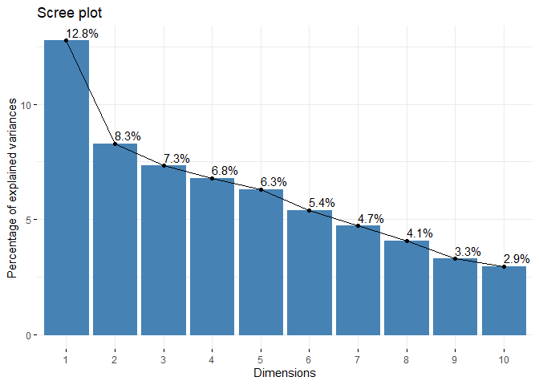
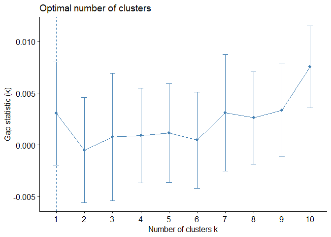
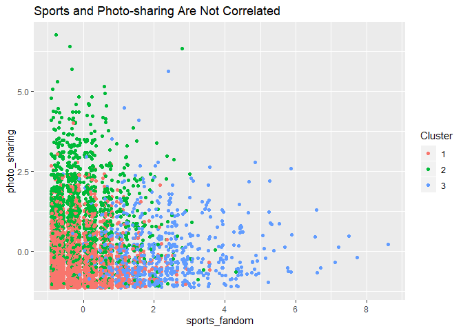
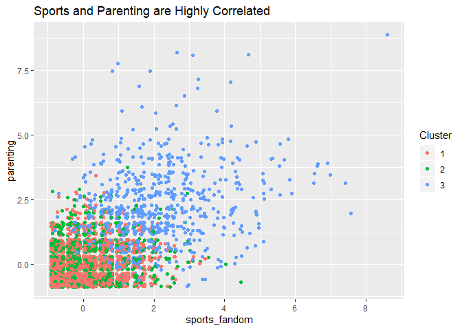
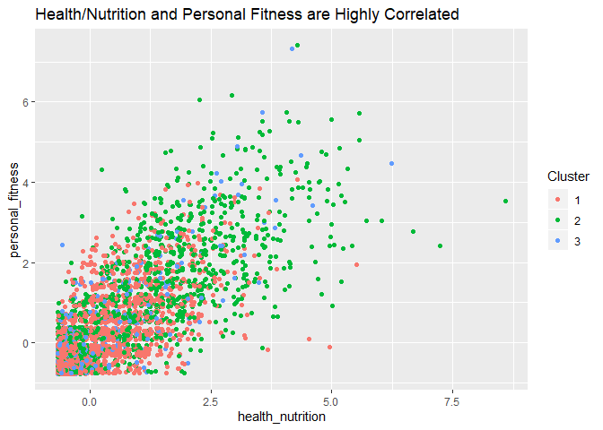
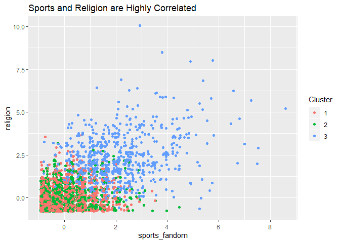
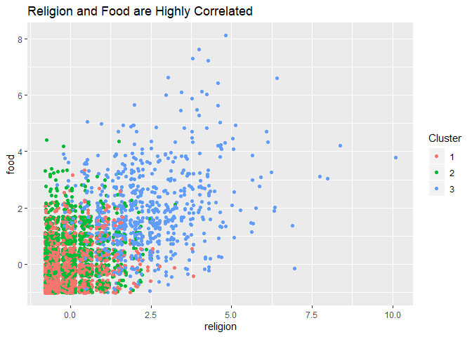
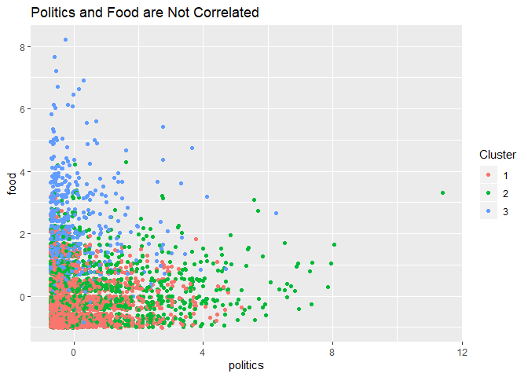
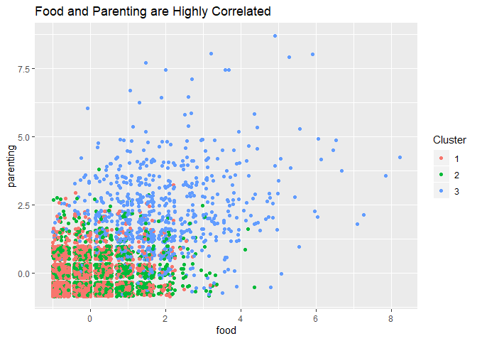
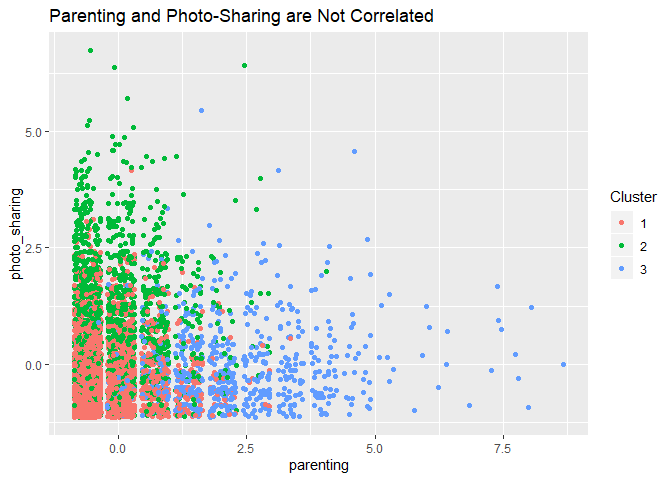

Market Segmentation
===================

To analyze the potential market for NutrientH2O, a sample of followers’
tweets over a seven-day period was analyzed and placed into 36 broad
categories for subject matter. This service was performed by contracted
workers of Amazon’s Mechanical Turk service: human annotators that are
prone to error and subjectivity. Some categories included were politics,
food, and school. However, there were also categories such as spam and
adult, whose observations were cut out of the data to focus on the most
pertinent individuals. But certain ambiguities still remain, such as
miscellaneous categories such as “chatter” and “uncategorized,” which
leads to even more noise in the data.

PCA Attempt
-----------

Principal component analysis (PCA) seems like it would be a good method
to analyze potential markets, since it is adept at handling noisy data
and can accommodate ambiguity, like tweets that lie in multiple
categories, unlike clusters, which strictly group individual points into
sections.

From the below summary, it appears as though 15 principal components are
necessary to explain about 75% of the variation in the data. This
indicates that the data is not easily summarized; the subject matter
variables are not differentiated enough to generate principal components
that explain a large percentage of the variation in the data. For
example, food, health\_nutrition, and cooking could all be overlapping
but lead to small fluctuations that lead to overfitting and more
principal components than necessary.

    ## Importance of components:
    ##                           PC1     PC2     PC3    PC4    PC5     PC6     PC7
    ## Standard deviation     2.1135 1.70202 1.60142 1.5416 1.4861 1.37498 1.28453
    ## Proportion of Variance 0.1276 0.08277 0.07327 0.0679 0.0631 0.05402 0.04714
    ## Cumulative Proportion  0.1276 0.21039 0.28366 0.3516 0.4147 0.46868 0.51583
    ##                           PC8     PC9    PC10    PC11    PC12    PC13    PC14
    ## Standard deviation     1.1951 1.07171 1.01558 0.99812 0.96691 0.95924 0.93983
    ## Proportion of Variance 0.0408 0.03282 0.02947 0.02846 0.02671 0.02629 0.02524
    ## Cumulative Proportion  0.5566 0.58945 0.61891 0.64738 0.67409 0.70038 0.72562
    ##                           PC15    PC16    PC17    PC18    PC19    PC20   PC21
    ## Standard deviation     0.93139 0.91864 0.89841 0.84763 0.80711 0.74792 0.6950
    ## Proportion of Variance 0.02479 0.02411 0.02306 0.02053 0.01861 0.01598 0.0138
    ## Cumulative Proportion  0.75040 0.77451 0.79757 0.81810 0.83671 0.85270 0.8665
    ##                           PC22    PC23    PC24    PC25    PC26    PC27    PC28
    ## Standard deviation     0.68505 0.65212 0.64893 0.63601 0.63141 0.61441 0.59779
    ## Proportion of Variance 0.01341 0.01215 0.01203 0.01156 0.01139 0.01079 0.01021
    ## Cumulative Proportion  0.87990 0.89205 0.90409 0.91564 0.92703 0.93782 0.94803
    ##                           PC29    PC30    PC31    PC32    PC33    PC34    PC35
    ## Standard deviation     0.59049 0.58391 0.55070 0.48212 0.47489 0.43661 0.42125
    ## Proportion of Variance 0.00996 0.00974 0.00866 0.00664 0.00644 0.00545 0.00507
    ## Cumulative Proportion  0.95799 0.96773 0.97640 0.98304 0.98948 0.99493 1.00000

The scree plot below confirms that PCA is not a good method for
summarizing the data. The “elbow” in this plot that shows the
dropping-off point, or diminishing marginal utility, of adding more
principal components seems to be after only one principal component. In
reality, this is not reasonable since this component only explains 13%
of the variation in the data. Fifteen principal components are needed to
explain 75% of the data, but this makes market segmentation more
confusing and convoluted.

There are too many principal components needed to explain the variation
in the data. Each principal component pulls apart a market segment, and
in doing so, takes us away from the big picture audience and plunges us
too much in the messy details.

K-Means Clustering Attempt
--------------------------

Instead, K-means clustering might generate more interpretable and
concise results.

Although the Gap statistic indicates that the best number of clusters is
supposedly 1, the value for k after which there is a dip in the
calculated Gap statistic, this is not a clear solution. The Gap
statistic values are all close to each other. In this case, the most
intuitive number of clusters is 3 clusters.

Below are the top 5 categories for each cluster, or group of individuals
that are closest together in their tweets across all the 37 different
topics that were measured. Although “chatter” appears for all 3
clusters, it is not a very significant measure that can be targeted
since it is somewhat of a “miscellaneous” category and is fraught with
noise. However, it is a gauge of how relatively active each cluster is,
and was therefore kept in these charts.

The value “X” shown is the number of standard deviations above the
average each cluster tweets about a certain topic.

<table class="table table-striped" style="width: auto !important; margin-left: auto; margin-right: auto;">
<caption>
Cluster 1
</caption>
<thead>
<tr>
<th style="text-align:left;">
</th>
<th style="text-align:right;">
x
</th>
</tr>
</thead>
<tbody>
<tr>
<td style="text-align:left;">
chatter
</td>
<td style="text-align:right;">
3.616900
</td>
</tr>
<tr>
<td style="text-align:left;">
photo\_sharing
</td>
<td style="text-align:right;">
1.878940
</td>
</tr>
<tr>
<td style="text-align:left;">
health\_nutrition
</td>
<td style="text-align:right;">
1.661997
</td>
</tr>
<tr>
<td style="text-align:left;">
current\_events
</td>
<td style="text-align:right;">
1.350482
</td>
</tr>
<tr>
<td style="text-align:left;">
politics
</td>
<td style="text-align:right;">
1.340193
</td>
</tr>
</tbody>
</table>
<table class="table table-striped" style="width: auto !important; margin-left: auto; margin-right: auto;">
<caption>
Cluster 2
</caption>
<thead>
<tr>
<th style="text-align:left;">
</th>
<th style="text-align:right;">
x
</th>
</tr>
</thead>
<tbody>
<tr>
<td style="text-align:left;">
chatter
</td>
<td style="text-align:right;">
6.317147
</td>
</tr>
<tr>
<td style="text-align:left;">
health\_nutrition
</td>
<td style="text-align:right;">
4.844208
</td>
</tr>
<tr>
<td style="text-align:left;">
photo\_sharing
</td>
<td style="text-align:right;">
4.720789
</td>
</tr>
<tr>
<td style="text-align:left;">
cooking
</td>
<td style="text-align:right;">
4.434497
</td>
</tr>
<tr>
<td style="text-align:left;">
politics
</td>
<td style="text-align:right;">
3.044006
</td>
</tr>
</tbody>
</table>
<table class="table table-striped" style="width: auto !important; margin-left: auto; margin-right: auto;">
<caption>
Cluster 3
</caption>
<thead>
<tr>
<th style="text-align:left;">
</th>
<th style="text-align:right;">
x
</th>
</tr>
</thead>
<tbody>
<tr>
<td style="text-align:left;">
sports\_fandom
</td>
<td style="text-align:right;">
5.866492
</td>
</tr>
<tr>
<td style="text-align:left;">
religion
</td>
<td style="text-align:right;">
5.232984
</td>
</tr>
<tr>
<td style="text-align:left;">
food
</td>
<td style="text-align:right;">
4.519634
</td>
</tr>
<tr>
<td style="text-align:left;">
chatter
</td>
<td style="text-align:right;">
4.069372
</td>
</tr>
<tr>
<td style="text-align:left;">
parenting
</td>
<td style="text-align:right;">
4.011780
</td>
</tr>
</tbody>
</table>

It seems as though one cluster has relatively inactive members that do
not skew strongly towards certain topics in their tweets; these do not
present a strong demographic to market towards.

However, the other two clusters present clearer trends. One of these
clusters represents a group of followers that is very interested in
health and nutrition, sharing photos, cooking, and politics. This
suggests that expanding to a platform that showcases more photos (such
as Instagram) and emphasizing the palatability and picture-worthy
aspects of NutrientH2O products would be highly effective.

Another cluster shows that many followers of Nutrient H2O are devoted to
sports, religion, food, and parenting. This suggests that targeting
parents during certain sports seasons may be effective, for example.

A Graphical Analysis with Clusters
----------------------------------

Below are some plots that demonstrate the different market segments in
NutrientH2O’s followers, focusing on variables that had a strong showing
in the 3 clusters.

The plot below shows that photo sharing and sports fanaticism are not
strongly correlated, so targeting the intersection of those two groups
is not recommended.

However, sports fanaticism and parenting seem to be highly correlated.
It is worth investigating parents that are into sports as a potential
market segment.

Although these clusters are not particularly distinct in the scatterplot
below, it shows that health\_nutrition and personal\_fitness are highly
correlated. This is an example of how some of the variables tracking
subject matter measure very similar things.

Sports fanaticism and religion are also highly correlated. However, in
promotions, it might be wise to target sports more than religion, as it
seems there is a greater concentration along the sports axis than the
religion axis for individuals that are not strongly into both topics.

Religion and food are also highly correlated. There appears to be a main
cluster of people that are both religious and into food; however, in
promotions, it would be wise to err on the side of featuring food
because there seems to be a greater concentration along the food axis in
a secondary cluster.

Here, food and parenting also seem to be highly correlated.

However, targeting these parents with pictures of food or visual ads in
general would not necessarily be an effective strategy.

Conclusion
----------

Overall, clustering was determined to be a more intuitive method than
PCA for determining market segments. The different groups were easier to
visualize, versus PCA which condensed the data into 15 different
principal components that separated out the overall audience into too
many subcategories.

NutrientH2O’s Twitter followers can be broken into 3 clusters. One
cluster seems to be relatively inactive, suggesting disengagement and an
audience that is not easily targeted because of a lack of engagement and
demonstrated preferences. The other two clusters show more apparent
trends.

Food, parenting, religion, and sports are all shown to be key interests
of NutrientH2O’s active follower base. However, certain strategies may
not be as effective in targeting these audiences. For instance, parents
are not keen on photo-sharing and may not be as receptive to solely
visual advertisements.
