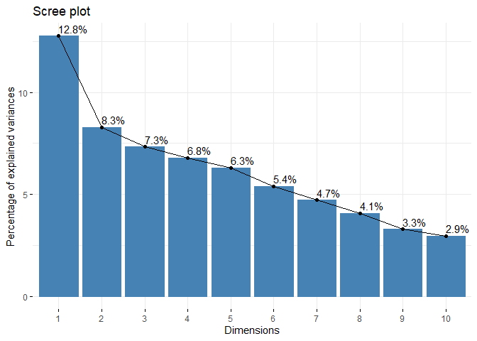

    ## Loading required package: dplyr

    ## 
    ## Attaching package: 'dplyr'

    ## The following objects are masked from 'package:stats':
    ## 
    ##     filter, lag

    ## The following objects are masked from 'package:base':
    ## 
    ##     intersect, setdiff, setequal, union

    ## Loading required package: lattice

    ## Loading required package: ggformula

    ## Loading required package: ggplot2

    ## Loading required package: ggstance

    ## 
    ## Attaching package: 'ggstance'

    ## The following objects are masked from 'package:ggplot2':
    ## 
    ##     geom_errorbarh, GeomErrorbarh

    ## 
    ## New to ggformula?  Try the tutorials: 
    ##  learnr::run_tutorial("introduction", package = "ggformula")
    ##  learnr::run_tutorial("refining", package = "ggformula")

    ## Loading required package: mosaicData

    ## Loading required package: Matrix

    ## Registered S3 method overwritten by 'mosaic':
    ##   method                           from   
    ##   fortify.SpatialPolygonsDataFrame ggplot2

    ## 
    ## The 'mosaic' package masks several functions from core packages in order to add 
    ## additional features.  The original behavior of these functions should not be affected by this.
    ## 
    ## Note: If you use the Matrix package, be sure to load it BEFORE loading mosaic.

    ## 
    ## Attaching package: 'mosaic'

    ## The following object is masked from 'package:Matrix':
    ## 
    ##     mean

    ## The following object is masked from 'package:ggplot2':
    ## 
    ##     stat

    ## The following objects are masked from 'package:dplyr':
    ## 
    ##     count, do, tally

    ## The following objects are masked from 'package:stats':
    ## 
    ##     binom.test, cor, cor.test, cov, fivenum, IQR, median, prop.test,
    ##     quantile, sd, t.test, var

    ## The following objects are masked from 'package:base':
    ## 
    ##     max, mean, min, prod, range, sample, sum

    ## -- Attaching packages ------------------------------------- tidyverse 1.3.0 --

    ## v tibble  2.1.3     v purrr   0.3.3
    ## v tidyr   1.0.0     v stringr 1.4.0
    ## v readr   1.3.1     v forcats 0.4.0

    ## -- Conflicts ---------------------------------------- tidyverse_conflicts() --
    ## x mosaic::count()            masks dplyr::count()
    ## x purrr::cross()             masks mosaic::cross()
    ## x mosaic::do()               masks dplyr::do()
    ## x tidyr::expand()            masks Matrix::expand()
    ## x dplyr::filter()            masks stats::filter()
    ## x ggstance::geom_errorbarh() masks ggplot2::geom_errorbarh()
    ## x dplyr::lag()               masks stats::lag()
    ## x tidyr::pack()              masks Matrix::pack()
    ## x mosaic::stat()             masks ggplot2::stat()
    ## x mosaic::tally()            masks dplyr::tally()
    ## x tidyr::unpack()            masks Matrix::unpack()

    ## Warning: package 'LICORS' was built under R version 3.6.3

    ## Warning: package 'foreach' was built under R version 3.6.3

    ## 
    ## Attaching package: 'foreach'

    ## The following objects are masked from 'package:purrr':
    ## 
    ##     accumulate, when

    ## 
    ## Attaching package: 'reshape2'

    ## The following object is masked from 'package:tidyr':
    ## 
    ##     smiths

    ## 
    ## Attaching package: 'kableExtra'

    ## The following object is masked from 'package:dplyr':
    ## 
    ##     group_rows

    ##    1    2    3    4    5 
    ##  417 6525  489  420   31

Below are some plots that demonstrate the different market segments in
NutrientH2O’s followers.

Below are the top 5 categories for each cluster, or group of individuals
that are closest together in their tweets across all the 37 different
topics that were measured. Although “chatter” appears for all 3
clusters, it is not a very significant measure that can be targeted.
However, it is a gauge of how relatively active each cluster is, and was
therefore kept in these charts.

The value “X” shown is the number of standard deviations above the
average each cluster tweets about a certain topic.

    ##          chatter health_nutrition    photo_sharing          cooking 
    ##         6.317147         4.844208         4.720789         4.434497 
    ##         politics 
    ##         3.044006

<table class="table table-striped" style="width: auto !important; margin-left: auto; margin-right: auto;">
<caption>
Cluster 1
</caption>
<thead>
<tr>
<th style="text-align:left;">
</th>
<th style="text-align:right;">
x
</th>
</tr>
</thead>
<tbody>
<tr>
<td style="text-align:left;">
chatter
</td>
<td style="text-align:right;">
6.317147
</td>
</tr>
<tr>
<td style="text-align:left;">
health\_nutrition
</td>
<td style="text-align:right;">
4.844208
</td>
</tr>
<tr>
<td style="text-align:left;">
photo\_sharing
</td>
<td style="text-align:right;">
4.720789
</td>
</tr>
<tr>
<td style="text-align:left;">
cooking
</td>
<td style="text-align:right;">
4.434497
</td>
</tr>
<tr>
<td style="text-align:left;">
politics
</td>
<td style="text-align:right;">
3.044006
</td>
</tr>
</tbody>
</table>

    ##          chatter    photo_sharing health_nutrition   current_events 
    ##         3.616900         1.878940         1.661996         1.350482 
    ##         politics 
    ##         1.340193

<table class="table table-striped" style="width: auto !important; margin-left: auto; margin-right: auto;">
<caption>
Cluster 2
</caption>
<thead>
<tr>
<th style="text-align:left;">
</th>
<th style="text-align:right;">
x
</th>
</tr>
</thead>
<tbody>
<tr>
<td style="text-align:left;">
chatter
</td>
<td style="text-align:right;">
3.616900
</td>
</tr>
<tr>
<td style="text-align:left;">
photo\_sharing
</td>
<td style="text-align:right;">
1.878940
</td>
</tr>
<tr>
<td style="text-align:left;">
health\_nutrition
</td>
<td style="text-align:right;">
1.661997
</td>
</tr>
<tr>
<td style="text-align:left;">
current\_events
</td>
<td style="text-align:right;">
1.350482
</td>
</tr>
<tr>
<td style="text-align:left;">
politics
</td>
<td style="text-align:right;">
1.340193
</td>
</tr>
</tbody>
</table>
<table class="table table-striped" style="width: auto !important; margin-left: auto; margin-right: auto;">
<caption>
Cluster 3
</caption>
<thead>
<tr>
<th style="text-align:left;">
</th>
<th style="text-align:right;">
x
</th>
</tr>
</thead>
<tbody>
<tr>
<td style="text-align:left;">
sports\_fandom
</td>
<td style="text-align:right;">
5.866492
</td>
</tr>
<tr>
<td style="text-align:left;">
religion
</td>
<td style="text-align:right;">
5.232984
</td>
</tr>
<tr>
<td style="text-align:left;">
food
</td>
<td style="text-align:right;">
4.519634
</td>
</tr>
<tr>
<td style="text-align:left;">
chatter
</td>
<td style="text-align:right;">
4.069372
</td>
</tr>
<tr>
<td style="text-align:left;">
parenting
</td>
<td style="text-align:right;">
4.011780
</td>
</tr>
</tbody>
</table>

It seems as though one cluster has relatively inactive members that do
not skew strongly towards certain topics in their tweets; these do not
present a strong demographic to market towards.

However, the other two clusters present clearer trends. One of these
clusters represents a group of followers that is very interested in
health and nutrition, sharing photos, cooking, and politics. This
suggests that expanding to a platform that showcases more photos (such
as Instagram) and emphasizing the palatability and picture-worthy
aspects of NutrientH2O products would be highly effective.

Another cluster shows that many followers of Nutrient H2O are devoted to
sports, religion, food, and parenting. This suggests that targeting
parents during certain sports seasons may be effective, for example.
