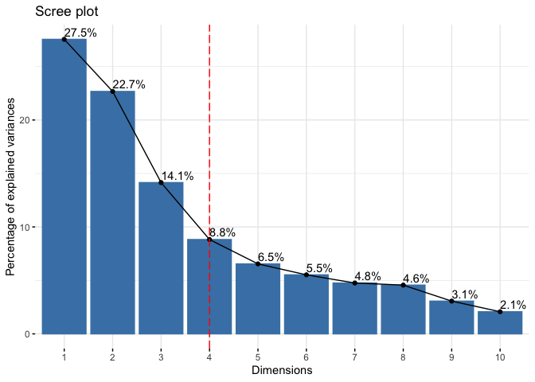
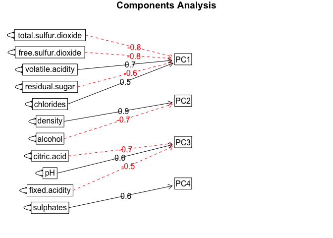
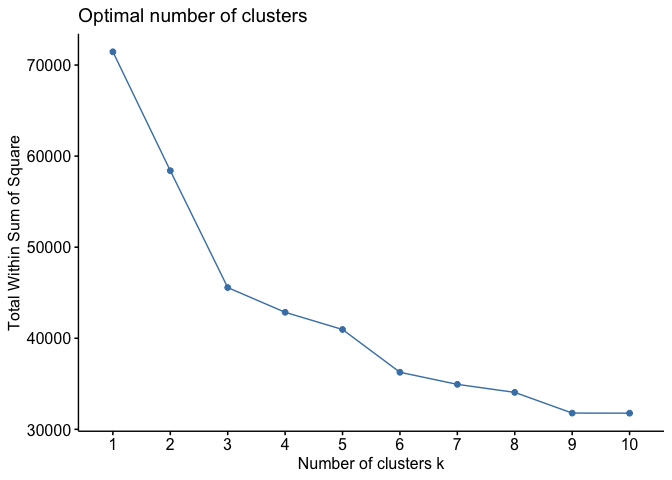

Wine
====

This data set includes 11 feature variables, a color factor variable
(red and white), and a scale from 1-10 of wine quality.

It appears that the red wines tend to be of lower quality than the white
wines, and there are more white wines in the data set than red wines.
The variables residual.sugar and chlorides have the most positive skew,
however most of the variables are skewed, with pH and citric.acid the
only variables that resemble a normal distribution. Some of the
variables are correlated with each other, such as free.sulfur.dioxide
and total.sulfur.dioxide, and some are negatively correlated, such as
density and alcohol. There is a positive relationship between alcohol
and quality. This dataset could benefit from PCA in a factor analysis
context to reduce the number of factors and make the results more
interpretable.

PCA
---

Looking at the scree plot, which plots the fraction of the total
variance in the data against the principal components. We can see that
there is no clear elbow but 4 components will suffice as it looks like
there is a bend at that point. These 4 components explain about 73% of
the variance. The biplot below shows that total.sulfur.dioxide and
free.sulfur.dioxide are correlated in PC1 and density makes the largest
contribution to PC2; density and acohol are inversely correlated. In
PC3, pH loads highly, and citric.acid is inversely correlated. For PC4,
the sulphates variable is large and negative; high values for sulphates
will be negatively correlated with this component. The component diagram
gives a big picture of the 4 components. The items vary in how much they
load (or correlate) with each component, but it is important to keep in
mind that the variables are also correlated with other components.

<table class="table" style="margin-left: auto; margin-right: auto;">
<thead>
<tr>
<th style="text-align:left;">
</th>
<th style="text-align:right;">
PC1
</th>
<th style="text-align:right;">
PC2
</th>
<th style="text-align:right;">
PC3
</th>
<th style="text-align:right;">
PC4
</th>
</tr>
</thead>
<tbody>
<tr>
<td style="text-align:left;">
fixed.acidity
</td>
<td style="text-align:right;">
-0.2387989
</td>
<td style="text-align:right;">
0.3363545
</td>
<td style="text-align:right;">
-0.4343013
</td>
<td style="text-align:right;">
0.1643462
</td>
</tr>
<tr>
<td style="text-align:left;">
volatile.acidity
</td>
<td style="text-align:right;">
-0.3807575
</td>
<td style="text-align:right;">
0.1175497
</td>
<td style="text-align:right;">
0.3072594
</td>
<td style="text-align:right;">
0.2127849
</td>
</tr>
<tr>
<td style="text-align:left;">
citric.acid
</td>
<td style="text-align:right;">
0.1523884
</td>
<td style="text-align:right;">
0.1832994
</td>
<td style="text-align:right;">
-0.5905697
</td>
<td style="text-align:right;">
-0.2643003
</td>
</tr>
<tr>
<td style="text-align:left;">
residual.sugar
</td>
<td style="text-align:right;">
0.3459199
</td>
<td style="text-align:right;">
0.3299142
</td>
<td style="text-align:right;">
0.1646884
</td>
<td style="text-align:right;">
0.1674430
</td>
</tr>
<tr>
<td style="text-align:left;">
chlorides
</td>
<td style="text-align:right;">
-0.2901126
</td>
<td style="text-align:right;">
0.3152580
</td>
<td style="text-align:right;">
0.0166791
</td>
<td style="text-align:right;">
-0.2447439
</td>
</tr>
<tr>
<td style="text-align:left;">
free.sulfur.dioxide
</td>
<td style="text-align:right;">
0.4309140
</td>
<td style="text-align:right;">
0.0719326
</td>
<td style="text-align:right;">
0.1342239
</td>
<td style="text-align:right;">
-0.3572789
</td>
</tr>
<tr>
<td style="text-align:left;">
total.sulfur.dioxide
</td>
<td style="text-align:right;">
0.4874181
</td>
<td style="text-align:right;">
0.0872663
</td>
<td style="text-align:right;">
0.1074623
</td>
<td style="text-align:right;">
-0.2084201
</td>
</tr>
<tr>
<td style="text-align:left;">
density
</td>
<td style="text-align:right;">
-0.0449366
</td>
<td style="text-align:right;">
0.5840373
</td>
<td style="text-align:right;">
0.1756056
</td>
<td style="text-align:right;">
0.0727250
</td>
</tr>
<tr>
<td style="text-align:left;">
pH
</td>
<td style="text-align:right;">
-0.2186864
</td>
<td style="text-align:right;">
-0.1558690
</td>
<td style="text-align:right;">
0.4553241
</td>
<td style="text-align:right;">
-0.4145511
</td>
</tr>
<tr>
<td style="text-align:left;">
sulphates
</td>
<td style="text-align:right;">
-0.2941352
</td>
<td style="text-align:right;">
0.1917158
</td>
<td style="text-align:right;">
-0.0700425
</td>
<td style="text-align:right;">
-0.6405357
</td>
</tr>
<tr>
<td style="text-align:left;">
alcohol
</td>
<td style="text-align:right;">
-0.1064371
</td>
<td style="text-align:right;">
-0.4650577
</td>
<td style="text-align:right;">
-0.2611005
</td>
<td style="text-align:right;">
-0.1068027
</td>
</tr>
</tbody>
</table>

PC1 and PC2 show a large cluster that has two smaller, distinct
clusters. However, there is not much separation between the two.
Unfortunately, PC1 and PC2 collectively make up only half of the
variation, so we are limited in our ability to reduce the number of
features.

K-Means Clustering
------------------

To determine the optimal number of clusters, we will look at an elbow
plot, which plots the total within sum of squares. This measures the
“compactness” of the clusters.

There is no clear bend in the plot, but it looks like 3 clusters is the
best choice. We also use the gap statistic, which suggests 5 clusters.

At 2 clusters, red and white wines are distinguished quite clearly on
the biplot despite the two being close together. As we can see, although
the distinction is kept between red and white, there is little to be
gained by using more than 2 clusters. However, since this biplot uses
PC1 and PC2 as its axes, there is likely more nuance that we are not
seeing. With 5 clusters, it seems that the red wines are split into two
subgroups and the white wines are split into 3 subgroups.

### Quality

    ##        Quality
    ## Cluster          3          4          5          6          7          8
    ##       1 0.26666667 0.13888889 0.32179607 0.24153738 0.12233550 0.12953368
    ##       2 0.13333333 0.26388889 0.26286249 0.26939351 0.20574606 0.17098446
    ##       3 0.20000000 0.09722222 0.10336763 0.09626234 0.12789620 0.06217617
    ##       4 0.23333333 0.31018519 0.21983162 0.12693935 0.04819277 0.02590674
    ##       5 0.16666667 0.18981481 0.09214219 0.26586742 0.49582947 0.61139896
    ##        Quality
    ## Cluster          9
    ##       1 0.20000000
    ##       2 0.00000000
    ##       3 0.00000000
    ##       4 0.00000000
    ##       5 0.80000000

Unfortunately, neither PCA nor K-Means is effective at differentiating
quality; there are too many wines with middle scores. As we can see by
the faceted plots, which shows a plot of each cluster and the percentage
of the quality, each cluster has a similar percentage of bad and good
wines. If k-means were able to discern quality, then the composition of
the clusters would be different, ideally with clusters comprised mostly
of one category. There is too much mediocrity in this dataset for
k-means to be effective in judging quality. Therefore, k-means is not
the best approach for finding wines of good quality.

#### Removing Mediocrity

Here, we remove the mediocre wines and look only at wines that are bad
(quality &lt; 5) or great (quality &gt; 7). Although the distinction is
still not entirely clear, k-means does a better job to distinguish good
and bad wines as cluster 1 seems to be comprised almost entirely of bad
wines, and cluster 3 has mostly good wines. However this is a pointless
exercise since this example would rarely exist in the real world. Also,
we have reduced the number of observations greatly which reduces our
confidence even more.

### Conclusion

By using PCA and k-means we were able to distinguish the red and white
wines to a reasonable degree, even though there is overlap between the
two. For PCA, we saw that most of the variation in the wine data could
be explained by 4 or 5 components. K-means was useful to see how
clustering could better prepare us to divide the data. Although the
first 2 principal components only explained half of the variation and
did not make for convenient visualization, we were able to see how the
factors were correlated and how the components are influenced by
different variables. When it comes to quality, however, we have been
unsuccessful. There are too many middle wines, and only a few terrible
or excellent wines. As a result, we can only see general correlations
between specific variables and quality, such as alcohol and quality; a
different technique would likely be more successful.
